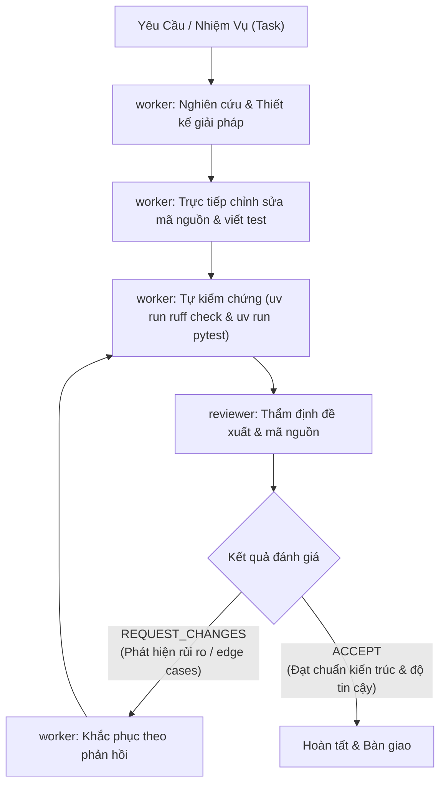

# Hướng Dẫn & Quy Chuẩn Phối Hợp Subagents: `Reviewer` & `Worker`

Tài liệu này định nghĩa vai trò, trách nhiệm, phạm vi công cụ và quy trình cộng tác giữa hai agent chuyên biệt trong dự án **`map_miner`**:
1. **`reviewer`**: Chuyên gia đánh giá, phản biện các đề xuất kỹ thuật, kế hoạch và mã nguồn.
2. **`worker`**: Chuyên viên nghiên cứu, tìm kiếm và trực tiếp thực thi giải pháp.

---

## 1. Mô Hình Phối Hợp (Dual-Agent Collaboration Workflow)



---

## 2. Chi Tiết Các Subagent

### 2.1. `reviewer` (Chuyên Gia Đánh Giá & Phản Biện)

- **Mục tiêu**: Đảm bảo tính toàn vẹn kiến trúc, phát hiện lỗi tiềm ẩn, rủi ro hồi quy và duy trì chất lượng kỹ thuật cao nhất cho codebase.
- **Phạm vi công cụ**:
  - **Read tools**: Khảo sát mã nguồn, tìm kiếm regex/tên file, đọc tài liệu.
  - **Write tools**: Không kích hoạt (`enable_write_tools=False`) để giữ tính khách quan tuyệt đối, tránh vô tình can thiệp trực tiếp vào mã nguồn đang đánh giá.
- **Tiêu chuẩn đánh giá**:
  1. **Tính đúng đắn & Khả thi (Feasibility & Correctness)**: Giải pháp có xử lý tận gốc vấn đề không?
  2. **Tuân thủ Kiến trúc ([CONTEXT.md](file:///data/IMPORTANT/map_miner/CONTEXT.md))**:
     - `scraper.py`: Thuần I/O và điều hướng mạng, không bóc tách dữ liệu phức tạp.
     - `extractor.py`: Thuần hàm tinh khiết (pure functions), tuyệt đối không có side-effects, không phụ thuộc trình duyệt hay I/O.
     - `recaptcha_solver.py`: Tự động giải CAPTCHA không làm nghẽn event loop, không xả file rác bừa bãi.
  3. **Tối ưu Băng thông & Hiệu năng**: Không sinh thêm request thừa, không làm chậm quá trình cuộn feed hay tải trang.
  4. **An toàn Bot & Ẩn danh (Anti-Bot & Stealth)**: Không đưa vào các hành vi dễ bị Google Maps nhận diện bot (ví dụ: click liên tục không delay, thiếu user-agent hợp lệ).
  5. **Độ tin cậy Kiểm thử (Testability)**: Bắt buộc phải có unit test kiểm chứng dựa trên dữ liệu thực tế (`tests/`).

---

### 2.2. `worker` (Chuyên Viên Tìm Kiếm & Thực Thi Giải Pháp)

- **Mục tiêu**: Nhanh chóng định vị nguyên nhân cốt lõi, hiện thực hóa các giải pháp kỹ thuật, triển khai tính năng và sửa lỗi dứt điểm.
- **Phạm vi công cụ**:
  - **Read tools**: Tra cứu toàn diện codebase, tìm kiếm web, đọc URL.
  - **Write & Execution tools**: Kích hoạt đầy đủ (`enable_write_tools=True`) để tạo/sửa file, thực thi lệnh trong môi trường `uv`.
- **Quy tắc làm việc**:
  1. **Thực thi dứt điểm**: Tập trung đúng phạm vi yêu cầu, không sửa đổi lan man sang các module không liên quan.
  2. **Tự động hóa kiểm thử**: Sau khi triển khai mã, luôn bổ sung unit test tương ứng trong thư mục `tests/`.
  3. **Không để lại nợ kỹ thuật (Zero Lint / Test Errors)**:
     - Luôn chạy: `uv run ruff check .` (phải đạt 0 lỗi).
     - Luôn chạy: `uv run ruff format .` (đảm bảo chuẩn formatting).
     - Luôn chạy: `uv run pytest` (100% tests phải pass).
  4. **Báo cáo tường minh**: Tóm tắt ngắn gọn các file đã thay đổi, lý do kỹ thuật và kết quả kiểm thử trước khi chuyển giao cho `reviewer`.

---

## 3. Cách Thức Khởi Chạy (Invocation Guide)

Cả hai agent đã được đăng ký sẵn trong môi trường Antigravity và có thể được gọi bất kỳ lúc nào:

### Gọi `worker` thực thi tác vụ:
```python
invoke_subagent(
    Subagents=[
        {
            "TypeName": "worker",
            "Role": "Solution Implementer",
            "Prompt": "Nghiên cứu và triển khai tính năng xuất dữ liệu ra file CSV/Parquet trong scraper.py, kèm theo unit test đầy đủ.",
        }
    ]
)
```

### Gọi `reviewer` phản biện giải pháp:
```python
invoke_subagent(
    Subagents=[
        {
            "TypeName": "reviewer",
            "Role": "Architecture Reviewer",
            "Prompt": "Đánh giá các thay đổi trong src/map_miner/scraper.py liên quan đến việc xử lý timeout mạng và cơ chế retry.",
        }
    ]
)
```
