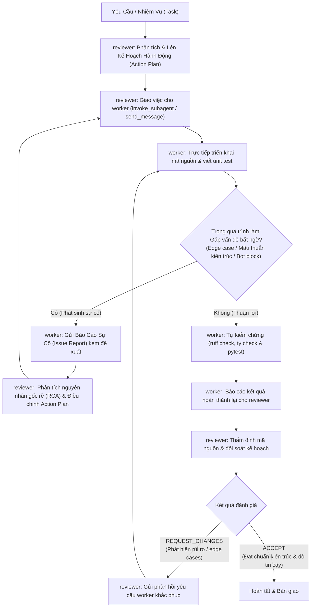
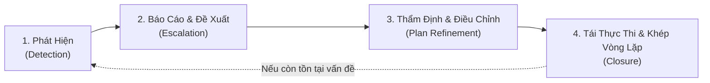

# Hướng Dẫn & Quy Chuẩn Phối Hợp Subagents: `Reviewer` & `Worker`

Tài liệu này định nghĩa vai trò, trách nhiệm, phạm vi công cụ và quy trình cộng tác giữa hai agent chuyên biệt trong dự án **`map_miner`**:
1. **`reviewer`**: Kiến trúc sư trưởng, chịu trách nhiệm nghiên cứu bài toán, lập kế hoạch hành động (Action Plan), giao việc cho `worker` và thẩm định, phản biện mã nguồn sau khi hoàn thành.
2. **`worker`**: Chuyên viên nghiên cứu, tìm kiếm và trực tiếp thực thi giải pháp kỹ thuật theo kế hoạch.

---

## 1. Mô Hình Phối Hợp (Dual-Agent Collaboration Workflow)



---

## 2. Chi Tiết Các Subagent

### 2.1. `reviewer` (Kiến Trúc Sư Lập Kế Hoạch & Thẩm Định)

- **Mục tiêu**: Định hướng giải pháp đúng chuẩn kiến trúc ngay từ đầu qua kế hoạch chi tiết, điều phối `worker` thực thi, và đảm bảo chất lượng kỹ thuật cao nhất cho codebase.
- **Phạm vi công cụ**:
  - **Read tools**: Khảo sát mã nguồn, tìm kiếm regex/tên file, đọc tài liệu.
  - **Subagent tools**: Kích hoạt (`enable_subagent_tools=True`) để có thể trực tiếp khởi tạo hoặc giao việc cho `worker` (`invoke_subagent`, `send_message`).
  - **Write tools**: Không kích hoạt (`enable_write_tools=False`) để giữ tính khách quan tuyệt đối, không trực tiếp sửa mã nguồn mà giao cho `worker`.
- **Trách nhiệm chính**:
  1. **Lên Kế Hoạch Hành Động (Action Planning)**:
     - Phân tích yêu cầu và đối soát với [CONTEXT.md](file:///data/IMPORTANT/map_miner/CONTEXT.md).
     - Định rõ các file cần sửa, hàm cần thêm/sửa, logic thuật toán, các trường hợp biên (edge cases).
     - Soạn thảo bản kế hoạch rõ ràng kèm tiêu chí nghiệm thu (Acceptance Criteria).
  2. **Điều phối `worker` (Task Dispatching)**:
     - Giao kế hoạch cho `worker` thực thi thông qua `invoke_subagent` hoặc gửi hướng dẫn qua `send_message`.
  3. **Thẩm định & Đánh giá (Reviewing & Verification)**:
     - Đánh giá mã nguồn `worker` đã viết dựa trên 5 tiêu chuẩn:
       1. **Tính đúng đắn & Khả thi (Feasibility & Correctness)**: Giải pháp có xử lý triệt để bài toán không?
       2. **Tuân thủ Kiến trúc ([CONTEXT.md](file:///data/IMPORTANT/map_miner/CONTEXT.md))**: Phân tách rõ ràng giữa I/O (`scraper.py`) và pure functions (`extractor.py`).
       3. **Tối ưu Băng thông & Hiệu năng**: Không sinh request thừa, không làm nghẽn event loop.
       4. **An toàn Bot & Ẩn danh (Anti-Bot & Stealth)**: Không tạo dấu hiệu bất thường cho Google Maps.
       5. **Độ tin cậy Kiểm thử & Chuẩn Kiểu (Testability & Type Safety)**: 100% tests phải pass (`uv run pytest`), 0 lỗi linter/format (`uv run ruff check .` & `uv run ruff format .`), và 0 lỗi type (`ty check` / `uv run ty check`), kèm unit test bao phủ các ca biên.
     - Đưa ra kết luận: `ACCEPT` hoặc `REQUEST_CHANGES`.
  4. **Tiếp nhận & Thẩm định Vấn đề Phát sinh (Issue Evaluation & Continuous Loop)**:
     - Khi nhận được báo cáo sự cố hoặc vấn đề bất ngờ từ `worker`/runtime (xung đột kiểu dữ liệu, bot block, thay đổi DOM, ca biên mới):
     - Chịu trách nhiệm phân tích nguyên nhân cốt lõi (Root Cause Analysis - RCA), đưa ra quyết định kiến trúc chuẩn xác, cập nhật Action Plan và tài liệu dự án ([CONTEXT.md](file:///data/IMPORTANT/map_miner/CONTEXT.md), [CHANGELOG.md](file:///data/IMPORTANT/map_miner/CHANGELOG.md)) để duy trì vòng lặp cải tiến liên tục.

---

### 2.2. `worker` (Chuyên Viên Tìm Kiếm & Thực Thi Giải Pháp)

- **Mục tiêu**: Nhanh chóng định vị nguyên nhân cốt lõi, hiện thực hóa các giải pháp kỹ thuật theo kế hoạch của `reviewer`, triển khai tính năng và sửa lỗi dứt điểm.
- **Phạm vi công cụ**:
  - **Read tools**: Tra cứu toàn diện codebase, tìm kiếm web, đọc URL.
  - **Write & Execution tools**: Kích hoạt đầy đủ (`enable_write_tools=True`) để tạo/sửa file, thực thi lệnh trong môi trường `uv`.
- **Quy tắc làm việc**:
  1. **Thực thi dứt điểm theo kế hoạch**: Bám sát Action Plan từ `reviewer`, không sửa đổi lan man sang các module không liên quan.
  2. **Tự động hóa kiểm thử**: Sau khi triển khai mã, luôn bổ sung unit test tương ứng trong thư mục `tests/`.
  3. **Không để lại nợ kỹ thuật (Zero Lint / Type / Test Errors)**:
     - Luôn chạy: `uv run ruff check .` (phải đạt 0 lỗi).
     - Luôn chạy: `uv run ruff format .` (đảm bảo chuẩn formatting PEP 8).
     - Luôn chạy: `ty check` (hoặc `uv run ty check`, đảm bảo 0 lỗi type annotations).
     - Luôn chạy: `uv run pytest` (100% tests phải pass).
  4. **Báo cáo tường minh**: Tóm tắt ngắn gọn các file đã thay đổi, lý do kỹ thuật và kết quả kiểm thử (ruff, ty, pytest), sau đó thông báo cho `reviewer` thẩm định.
  5. **Chủ động báo cáo vấn đề phát sinh (Proactive Issue Escalation)**:
     - Khi gặp tình huống ngoài kế hoạch (xung đột kiểu dữ liệu, edge cases mới, bot block mới, nguy cơ hồi quy):
     - Worker tuyệt đối không tự ý đưa ra quyết định kiến trúc tùy tiện mà phải gửi ngay thông báo chi tiết (theo mẫu Issue Report) cho `reviewer` để được định hướng giải quyết.

---

## 3. Quy Chuẩn Vòng Lặp Phản Hồi Liên Tục (Continuous Feedback & Adaptation Loop)

Để đảm bảo hệ thống vừa duy trì tính kỷ luật kiến trúc cao vừa thích ứng linh hoạt trước những thay đổi ngoại cảnh bất ngờ (Google Maps đổi cấu trúc DOM, bot detection siết chặt, các ca biên dữ liệu phức tạp), `reviewer` và `worker` tuân thủ quy trình vòng lặp phản hồi 4 bước chuẩn hóa:



### 3.1. Quy Trình 4 Bước Của Vòng Lặp

1. **Bước 1: Phát Hiện (Detection)**:
   - `worker` trong quá trình thực thi hoặc chạy test suite phát hiện lỗi không lường trước, hành vi bất thường của runtime, mâu thuẫn giữa kế hoạch và thực tế codebase, hoặc các trường hợp biên chưa được dự liệu.
2. **Bước 2: Báo Cáo & Nêu Đề Xuất (Escalation with Options)**:
   - `worker` tạm dừng nhánh thay đổi có rủi ro, cô lập hiện tượng và gửi `send_message` chứa **Báo Cáo Sự Cố (Issue Report)** chuẩn hóa về cho `reviewer`. Trong báo cáo phải nêu rõ các phương án giải quyết tiềm năng kèm ưu/nhược điểm kỹ thuật.
3. **Bước 3: Thẩm Định & Điều Chỉnh Kế Hoạch (Evaluation & Plan Refinement)**:
   - `reviewer` nghiên cứu hiện tượng, thực hiện Root Cause Analysis (RCA), thẩm định các đề xuất, đưa ra quyết định kiến trúc tối ưu nhất (bảo toàn nguyên tắc thiết kế và hiệu năng), sau đó cập nhật Action Plan điều chỉnh và gửi lại cho `worker`.
4. **Bước 4: Tái Thực Thi & Khép Vòng Lặp (Re-execution & Closure)**:
   - `worker` tiếp nhận Action Plan điều chỉnh, triển khai mã nguồn, bổ sung unit test kiểm chứng ca biên vừa phát sinh, xác nhận 0 technical debt và gửi báo cáo nghiệm thu hoàn tất vòng lặp.

---

### 3.2. Mẫu Chuẩn Báo Cáo Sự Cố Phát Sinh (Issue Report Template)

Khi gửi báo cáo sự cố qua `send_message`, `worker` áp dụng mẫu cấu trúc markdown sau:

```markdown
### 🚨 [ISSUE REPORT] Tên Vấn Đề / Hiện Tượng

- **Ngữ cảnh & Tác động (Context & Impact)**:
  * Module/Hàm bị ảnh hưởng: `path/to/file.py::func_name`
  * Hiện tượng xảy ra: Mô tả lỗi runtime, mismatch schema, hoặc bot block.
  * Tác động: Gây fail test nào, hoặc ảnh hưởng đến luồng cào dữ liệu ra sao.

- **Nguyên nhân cốt lõi sơ bộ (Preliminary Root Cause)**:
  * Phân tích tại sao vấn đề xuất hiện (do cấu trúc HTML Google Maps thay đổi, timeout ngắn, kiểu dữ liệu union phức tạp, v.v.).

- **Các phương án khả dĩ (Proposed Solutions)**:
  * **Phương án A**: Mô tả giải pháp -> Ưu điểm / Nhược điểm.
  * **Phương án B**: Mô tả giải pháp -> Ưu điểm / Nhược điểm.

- **Quyết định cần từ Reviewer (Reviewer Decision Needed)**:
  * Câu hỏi hoặc đề xuất phê duyệt phương án cụ thể để điều chỉnh Action Plan.
```

---

## 4. Cách Thức Khởi Chạy (Invocation Guide)

### Khởi chạy `reviewer` để lập kế hoạch, giao việc cho `worker` và thẩm định:
```python
invoke_subagent(
    Subagents=[
        {
            "TypeName": "reviewer",
            "Role": "Lead Architect & Reviewer",
            "Prompt": "Phân tích yêu cầu thêm tính năng X, lập kế hoạch hành động chi tiết, giao việc cho worker thực thi và tiến hành review kết quả.",
        }
    ]
)
```

### Gọi trực tiếp `worker` khi đã có sẵn kế hoạch cụ thể:
```python
invoke_subagent(
    Subagents=[
        {
            "TypeName": "worker",
            "Role": "Solution Implementer",
            "Prompt": "Thực thi theo kế hoạch đã duyệt: triển khai tính năng X trong scraper.py, kèm unit test đầy đủ.",
        }
    ]
)
```
