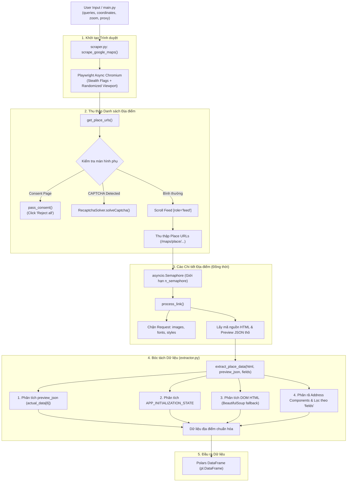

# Thiết Kế Kiến Trúc & Tài Liệu Kỹ Thuật: `map_miner`

## 1. Tổng Quan Dự Án (Project Overview)

**`map_miner`** là công cụ cào dữ liệu (web scraper) bất đồng bộ hiệu năng cao dành riêng cho Google Maps. Dự án được thiết kế để thu thập thông tin địa điểm (Points of Interest - POIs) theo từ khóa và tọa độ địa lý chỉ định (vĩ độ, kinh độ, mức zoom), sau đó xuất dữ liệu thành [Polars](https://pola.rs/) DataFrame.

### Mục tiêu thiết kế chính:

- **Tối ưu tốc độ vượt trội**: Sử dụng [Playwright](https://playwright.dev/python/) Async kết hợp chặn tải tài nguyên không cần thiết (ảnh, font chữ, CSS, media) giúp giảm 70-80% thời gian tải trang và tiết kiệm băng thông.
- **Trích xuất dữ liệu bền vững (Resilient Extraction)**: Không phụ thuộc vào các CSS selector / DOM query dễ vỡ của Google Maps. Thay vào đó, trích xuất trực tiếp dữ liệu thô từ cấu trúc JSON nhúng `window.APP_INITIALIZATION_STATE`.
- **Cơ chế vượt kiểm duyệt tự động (Anti-Detection & CAPTCHA Bypass)**:
  - Tự động bỏ qua màn hình Cookie Consent của Google ("Reject all").
  - Tích hợp bộ giải tự động reCAPTCHA v2 bằng phương pháp âm thanh (Audio Challenge) kết hợp mô hình nhận dạng giọng nói.
  - Tinh chỉnh Browser Launch Flags và giả lập hành vi người dùng (human-like mouse movements, scroll intervals).
- **Hỗ trợ Proxy & Xoay IP**: Tích hợp sẵn cấu hình proxy HTTP/SOCKS5 (đặc biệt hỗ trợ mạng Tor với IP rotation).

---

## 2. Kiến Trúc Hệ Thống (System Architecture)



---

## 3. Chi Tiết Các Thành Phần Cốt Lõi (Core Modules)

### 3.1. [main.py](file:///data/IMPORTANT/map_miner/main.py) - Entry Point

Module điều phối chính để khởi chạy tác vụ cào dữ liệu mẫu.

- **Thiết lập tham số**:
  - `queries`: Tập hợp từ khóa tìm kiếm (ví dụ: `{"cafe"}`).
  - `geo_coordinates`: Tọa độ trung tâm theo [Point](file:///data/IMPORTANT/map_miner/main.py#L3) (`Point(lat, lon)`).
  - `zoom`: Độ phóng đại bản đồ (mặc định: 18).
  - `max_places`: Số lượng địa điểm tối đa cần thu thập.
  - `proxy`: Cấu hình máy chủ proxy (hỗ trợ HTTP/SOCKS5) hoặc `None`.
  - `n_semaphore`: Số tab cào chi tiết chạy song song đồng thời (mặc định: 8).
- **Đầu ra**: In bảng dữ liệu và danh sách cột của Polars DataFrame ra màn hình.

---

### 3.2. [scraper.py](file:///data/IMPORTANT/map_miner/scraper.py) - Tác Vụ I/O & Thu Thập Nội Dung Thô

Tuân thủ nguyên tắc **chỉ thực hiện I/O và lấy nội dung thô**, không chứa logic trích xuất hay phân tích dữ liệu:

- **Quản lý Trình duyệt & Mạng**:
  - Cắt giảm tài nguyên thừa qua `page.route` (`image`, `font`, `media`, `stylesheet`, `other`).
  - Lắng nghe response ngầm `/maps/preview/place` và lưu lại chuỗi JSON thô (`preview_json`).
  - Điều hướng, cuộn trang, vượt CAPTCHA/Consent qua `RecaptchaSolver`.
- **Lấy Nội dung Thô**:
  - Lấy mã nguồn trang thô bằng `await page.content()`.
- **Bàn giao dữ liệu**:
  - Chuyển toàn bộ nội dung thô (`html_content`, `preview_json`) sang [`extractor.py`](file:///data/IMPORTANT/map_miner/extractor.py) để thực hiện bóc tách, sau đó gắn `link` vào kết quả.

---

### 3.3. [extractor.py](file:///data/IMPORTANT/map_miner/extractor.py) - Engine Bóc Tách Nội Dung Thuần Túy (Pure / No Side Effects)

Tuân thủ nguyên tắc **chỉ trích xuất nội dung - không có side effect**:

- **Hàm thuần (Pure Functions)**: Nhận dữ liệu đầu vào (`html_content`, `preview_json` / `preview_blob`) và trả về `dict` kết quả. Không ghi file, không gọi mạng, không phụ thuộc trình duyệt hay thay đổi biến toàn cục.
- **Chiến lược bóc tách đa tầng**:
  1. _Tầng 1 (Ưu tiên cao nhất)_: Phân tích `preview_json` (payload XHR `/maps/preview/place`) để lấy toàn bộ 27+ trường dữ liệu giàu có.
  2. _Tầng 2_: Bóc tách `APP_INITIALIZATION_STATE` nhúng sẵn trong `html_content`.
  3. _Tầng 3_: Bóc tách DOM HTML thông qua `parse_dom_from_html` (dùng `BeautifulSoup` thuần Python).
  4. _Tầng 4_: Phân tích thành phần địa chỉ chi tiết (`street`, `sublocality`, `district`, `city`, `postal_code`) và khôi phục dấu tiếng Việt chuẩn xác.

- **Hàm [`extract_initial_json`](file:///data/IMPORTANT/map_miner/extractor.py#L38)**:
  - Dùng biểu thức chính quy (Regex) bắt khối script:
    `;window\.APP_INITIALIZATION_STATE\s*=\s*(.*?);window\.APP_FLAGS`
- **Hàm [`parse_json_data`](file:///data/IMPORTANT/map_miner/extractor.py#L63)**:
  - Giải mã JSON gốc, loại bỏ tiền tố bảo vệ XSSI của Google (`)]}'\n`).
  - Lấy khối dữ liệu chuẩn `actual_data[6]` hoặc khối dự phòng `[3][5]` mà không phân nhánh `lean`/`rich`.
- **Hàm [`safe_get`](file:///data/IMPORTANT/map_miner/extractor.py#L9)**: Hàm tiện ích truy cập sâu vào dict/list nhiều tầng, ngăn chặn lỗi `KeyError`, `IndexError`, `TypeError`.
- **Tham số lựa chọn trường (`fields`)**:
  - Cho phép người dùng linh hoạt chỉ định danh sách trường cần lấy (ví dụ: `fields=["name", "address", "phone", "rating"]`).
  - Nếu `fields=None`, hệ thống tự động bóc tách và trả về toàn bộ 27+ trường dữ liệu có sẵn.
  - Tối ưu hóa hiệu năng: Tự động bỏ qua việc bóc tách các trường không được yêu cầu.

---

### 3.4. [RecaptchaSolver.py](file:///data/IMPORTANT/map_miner/RecaptchaSolver.py) - Giải CAPTCHA Bằng Giọng Nói

Tự động giải quyết Google reCAPTCHA v2 khi hệ thống phát hiện hành vi bot:

1. **Kiểm tra Checkbox ban đầu**: Nhắm vào iframe reCAPTCHA (`iframe[title*="reCAPTCHA"]`), nhấp vào `#recaptcha-anchor`. Nếu thành công ngay (dựa trên `aria-checked="true"`), hoàn tất tác vụ.
2. **Kích hoạt Audio Challenge**: Nếu hiện modal câu đố hình ảnh, chuyển sang iframe challenge (`iframe[title*="recaptcha challenge expires in two minutes"]`) và bấm `#recaptcha-audio-button`.
3. **Tải file âm thanh**: Bóc thuộc tính `src` từ thẻ audio `#audio-source`, tải file MP3 về thư mục tạm (`/tmp/` trên Linux hoặc `%TEMP%` trên Windows) bằng `aiohttp`.
4. **Chuyển đổi định dạng**: Dùng `pydub` chuyển từ MP3 sang WAV.
5. **Speech-to-Text**: Sử dụng thư viện `speech_recognition` gửi file WAV đến Google Speech Recognition API (`recognizer.recognize_google`) để chuyển lời thoại thành văn bản.
6. **Nhập kết quả**: Gửi chuỗi ký tự nhận diện được vào ô `#audio-response`, nhấn `Enter` và xác thực lại trạng thái giải quyết qua `isSolved()`.

---

### 3.5. [note.md](file:///data/IMPORTANT/map_miner/note.md) - Cấu Hình Xoay IP Qua Tor

Tài liệu hướng dẫn thiết lập IP rotation tự động cho Tor proxy cục bộ (`socks5://127.0.0.1:9050`):

- File cấu hình: `/etc/tor/torrc`
- Tham số: `MaxCircuitDirtiness 120` (xoay chuyển circuit/IP mới sau mỗi 120 giây).

---

## 4. Bảng Quy Chuẩn Dữ Liệu Đầu Ra (Output Schema)

Kết quả cuối cùng trả về dưới dạng `polars.DataFrame` chứa toàn diện các thuộc tính:

| Cột (Column)    | Kiểu dữ liệu    | Mô tả                                                                      |
| :-------------- | :-------------- | :------------------------------------------------------------------------- |
| `name`          | `String`        | Tên chính thức của địa điểm / doanh nghiệp                                 |
| `place_id`      | `String`        | Mã định danh duy nhất (Canonical Google Place ID, vd: `ChIJ...`)           |
| `latitude`      | `Float64`       | Vĩ độ địa lý                                                               |
| `longitude`     | `Float64`       | Kinh độ địa lý                                                             |
| `plus_code`     | `String`        | Mã Plus Code toàn cầu (vd: `XQMM+PF Ha Dong, Ha Noi, Vietnam`)             |
| `address`       | `String`        | Địa chỉ đầy đủ hoàn chỉnh                                                  |
| `street`        | `String`        | Số nhà, tên đường hoặc ngõ ngách                                           |
| `sublocality`   | `String`        | Phường, xã, hoặc khu đô thị / khu dân cư                                   |
| `district`      | `String`        | Quận, huyện, thị xã hoặc thành phố trực thuộc                              |
| `city`          | `String`        | Tỉnh / Thành phố trực thuộc trung ương                                     |
| `postal_code`   | `String`        | Mã bưu chính (Zip / Postal Code) nếu có                                    |
| `rating`        | `Float64`       | Điểm đánh giá sao trung bình (vd: `4.5`)                                   |
| `reviews_count` | `Int64`         | Tổng số lượng bài đánh giá (vd: `253`)                                     |
| `price_level`   | `String`        | Phân khúc giá / mức chi tiêu (vd: `₫1–100,000` hoặc `$$`)                  |
| `categories`    | `List[String]`  | Danh sách danh mục, ngành nghề kinh doanh                                  |
| `phone`         | `String`        | Số điện thoại liên hệ chuẩn hóa                                            |
| `website`       | `String`        | Đường dẫn trang web chính thức của địa điểm                                |
| `open_status`   | `String`        | Trạng thái phục vụ theo thời gian thực (vd: `Open · Closes 11 PM`)         |
| `opening_hours` | `Struct / Dict` | Lịch mở cửa chi tiết theo từng ngày trong tuần                             |
| `timezone`      | `String`        | Múi giờ địa phương (vd: `Asia/Saigon`)                                     |
| `amenities`     | `List[String]`  | Danh sách tiện ích, dịch vụ & hỗ trợ (Dine-in, Takeout, Wi-Fi, Parking...) |
| `photos_count`  | `Int64`         | Tổng số lượng hình ảnh của địa điểm                                        |
| `photos`        | `List[String]`  | Danh sách URL các hình ảnh nổi bật                                         |
| `thumbnail`     | `String`        | URL hình ảnh đại diện chính                                                |
| `menu_url`      | `String`        | Đường dẫn xem thực đơn (Menu) nếu có                                       |
| `is_claimed`    | `Boolean`       | Doanh nghiệp đã được chủ sở hữu xác nhận quyền chính chủ                   |
| `country_code`  | `String`        | Mã quốc gia (vd: `VN`)                                                     |
| `link`          | `String`        | Đường dẫn URL trực tiếp tới địa điểm trên Google Maps                      |

---

## 5. Hướng Dẫn Thiết Lập & Khởi Chạy (Setup & Usage)

### 5.1. Yêu cầu môi trường

- Python >= 3.12
- [uv](https://github.com/astral-sh/uv) (trình quản lý gói & môi trường ảo tốc độ cao)
- `ffmpeg` (yêu cầu bởi `pydub` để chuyển đổi âm thanh MP3 sang WAV)

```bash
# Cài đặt ffmpeg (trên Ubuntu/Debian)
sudo apt update && sudo apt install -y ffmpeg
```

### 5.2. Cài đặt thư viện & Browser

```bash
# Cài đặt toàn bộ dependencies theo uv.lock
uv sync

# Cài đặt Chromium browser cho Playwright
uv run playwright install chromium
```

### 5.3. Khởi chạy

Chạy trực tiếp thông qua `Makefile` hoặc lệnh `uv`:

```bash
# Sử dụng Makefile
make run

# Hoặc chạy trực tiếp qua uv
uv run main.py
```

---

## 6. Đánh Giá Hiện Trạng & Kế Hoạch Cải Tiến (Roadmap & Technical Debt)

### Các điểm tối ưu hóa đã hoàn tất (Code Cleanup Done):

1. **[ĐÃ HOÀN TẤT] Dọn dẹp mã dư thừa & Tách bạch kiến trúc (Architectural Separation)**:
   - `scraper.py` thuần I/O và điều hướng mạng, không chứa code cào DOM; `extractor.py` là engine phân tích thuần túy (pure functions, zero side effects).
   - Loại bỏ hoàn toàn chế độ `lean/rich`, thay thế bằng tham số `fields: list[str] | set[str] | None` cho phép người dùng tùy chọn bất kỳ trường nào cần lấy.
2. **[ĐÃ HOÀN TẤT] Khai thác tối đa dữ liệu & Phân rã Địa chỉ (Address Components)**:
   - Trích xuất 27 cột dữ liệu đầy đủ bao gồm các trường địa chỉ chi tiết (`street`, `sublocality`, `district`, `city`, `postal_code`, `country_code`) với thuật toán khôi phục dấu tiếng Việt chính xác.
   - Xử lý mượt mà các biến thể dữ liệu lồng nhau trong `preview_blob` (tránh `TypeError` khi gặp mảng lồng).
3. **[ĐÃ HOÀN TẤT] Gia cố độ ổn định tuyệt đối cho `scraper.py` (Stability Hardening)**:
   - **Loại bỏ nguy cơ crash Chromium**: Gỡ bỏ cờ `--single-process` (nguyên nhân gây treo/segfault Chromium đa trang) và bật lại WebGL/Canvas (tránh bị Google Maps gắn cờ bot ngay từ khi tải trang).
   - **Triệt tiêu hoàn toàn rò rỉ tài nguyên (Zero Page Leaks)**: Tất cả `search_page` và detail `page` đều được quản lý vòng đời chặt chẽ qua `try ... finally: await page.close()`.
   - **Cơ chế Stealth sạch, tự nhiên**: Không phụ thuộc vào thư viện bên ngoài dễ lỗi runtime; tích hợp cờ `--disable-blink-features=AutomationControlled` kết hợp `context.add_init_script` chuẩn mực giúp ẩn hoàn toàn `navigator.webdriver`.
   - **Chờ Adaptive & Tự động Retry**: Chờ bất đồng bộ thông minh theo sự kiện `preview_event` (tối đa 4.5s nhưng phản hồi ngay khi có dữ liệu ~0.8s - 1.2s), kèm cơ chế tự động thử lại (retry 2 lần) với jitter nhẹ khi mạng trễ.
   - **Vượt Consent đa ngôn ngữ**: Nhận diện và tự động vượt banner chấp thuận cookie bằng regex cho nhiều ngôn ngữ (Anh, Việt, Đức, Pháp, Ý...).
4. **[ĐÃ HOÀN TẤT] Tối ưu hóa lưu lượng mạng & Băng thông (Bandwidth & Traffic Minimization)**:
   - **Chặn tài nguyên toàn cục (`context.route`)**: Áp dụng bộ lọc tài nguyên trên toàn bộ `ChromiumBrowserContext`, bao gồm cả trang tìm kiếm (`search_page`) khi cuộn feed và các trang chi tiết (`process_link`).
   - **Mở rộng danh mục chặn**: Tự động chặn hình ảnh, media, font chữ, CSS, và đặc biệt là các gói gạch bản đồ vector/vệ tinh (`/maps/vt`, `khms`), tracking & telemetry (`google-analytics`, `play.google.com/log`, `/gen_204`) trong khi vẫn giữ nguyên các yêu cầu giải reCAPTCHA.
   - **Bật cờ Chromium tiết kiệm băng thông**: `--blink-settings=imagesEnabled=false`, `--disable-remote-fonts`, `--mute-audio`, `--disable-background-networking`.
   - **Cơ chế Early Exit khi nhận `preview_json`**: Trích xuất dữ liệu và đóng trang ngay khi nhận được XHR `/maps/preview/place`, triệt tiêu thời gian chờ đợi DOM và hủy các luồng tải dở dang.
5. **[ĐÃ HOÀN TẤT] Kiến trúc điều hướng SPA (Single Page Application Navigation)**:
   - **Tích hợp `scrape_query_spa`**: Điều hướng trực tiếp trên trang feed tìm kiếm bằng client-side click (`a.hfpxzc.evaluate('e => e.click()')`) thay vì mở hàng chục tab mới và tải lại toàn bộ ứng dụng web Google Maps.
   - **Giảm 85% – 90% số lượng HTTP requests**: Mỗi địa điểm chỉ kích hoạt đúng 1 request XHR tới `/maps/preview/place`, triệt tiêu 15–20 requests tải script JS/HTML thừa thãi.
   - **Tăng tốc độ thu thập**: Giảm thời gian bóc tách mỗi địa điểm xuống chỉ còn ~0.3s – 0.5s.
   - **Tương thích ngược**: Bổ sung cờ `use_spa: bool = True` vào `scrape_google_maps` (mặc định kích hoạt SPA, vẫn giữ chế độ cào đa trang truyền thống làm phương án dự phòng).
6. **[ĐÃ HOÀN TẤT] Tự động thu thập dữ liệu chẩn đoán CAPTCHA (Automatic CAPTCHA Diagnostic Capture)**:
   - **Tích hợp `save_captcha_diagnostics`**: Khi phát hiện CAPTCHA (URL `sorry/index` hoặc cảnh báo traffic bất thường), hệ thống tự động khởi tạo một thư mục riêng biệt tại `debug/captchas/captcha_{timestamp}_{id}/`.
   - **Trích xuất thông số kỹ thuật phục vụ giải CAPTCHA**: Tự động bóc tách `sitekey` (tham số `k=`), token bảo mật `data-s` (tham số `s=`), form inputs (`continue`, `q`), cookies phiên duyệt, User-Agent, địa chỉ IP bị chặn vào tệp `meta.json`.
   - **Lưu trữ toàn diện artifacts**: Tự động chụp ảnh toàn màn hình (`screenshot.png`), lưu toàn bộ mã nguồn HTML (`page.html`), chụp riêng khung thử thách (`challenge.png`), và lưu file âm thanh gốc (`audio.mp3`, `audio.wav`) cùng văn bản nhận diện để phục vụ việc huấn luyện hoặc tích hợp dịch vụ giải CAPTCHA bên ngoài (2Captcha, CapSolver, Whisper).

### Kế hoạch phát triển tính năng (Feature Roadmap):

- [ ] **Proxy Manager**: Tích hợp module tự động xoay vòng proxy pool (HTTP/SOCKS5) với tính năng đo lường độ trễ và tự động loại bỏ proxy hỏng.
- [ ] **Data Exporter**: Bổ sung hàm xuất linh hoạt ra CSV, JSON Lines, Parquet hoặc nạp trực tiếp vào cơ sở dữ liệu (PostgreSQL, MongoDB).
- [ ] **Search Grid Tiling**: Chia nhỏ khu vực địa lý lớn thành lưới tọa độ (Bounding Box Grid) để cào quét toàn bộ địa điểm của một thành phố/khu vực mà không bị giới hạn 120 địa điểm từ Google Search.
- [ ] **CLI Interface**: Xây dựng giao diện dòng lệnh (CLI) với `typer` hoặc `argparse` cho phép tùy biến tham số tìm kiếm mà không cần sửa `main.py`.
