# Thiết Kế Kiến Trúc & Tài Liệu Kỹ Thuật: `map_miner`

## 1. Tổng Quan Dự Án (Project Overview)

**`map_miner`** (phiên bản `0.3.4`) là thư viện Python và công cụ cào dữ liệu (web scraper) bất đồng bộ hiệu năng cao dành riêng cho Google Maps. Dự án được thiết kế để thu thập thông tin địa điểm (Points of Interest - POIs) chi tiết theo từ khóa và tọa độ địa lý chỉ định (vĩ độ, kinh độ, mức zoom), sau đó chuẩn hóa và xuất dữ liệu thành [Polars](https://pola.rs/) DataFrame (`pl.DataFrame`).

### Mục tiêu thiết kế chính:

- **Kiến trúc SPA Navigation đột phá**: Mặc định điều hướng client-side trực tiếp trên trang kết quả tìm kiếm Google Maps (`use_spa=True`), kích hoạt sự kiện click thẻ địa điểm và chặn bắt trực tiếp gói tin XHR `/maps/preview/place`. Phương pháp này giúp giảm **85% – 90%** số lượng HTTP requests, triệt tiêu việc reload trang và tăng tốc độ cào lên đến **~0.3s – 0.5s / địa điểm**.
- **Chế độ dự phòng đa trang (Multi-page Fallback Mode)**: Hỗ trợ chế độ cào truyền thống song song qua `asyncio.Semaphore` (`use_spa=False`) mở từng tab địa điểm độc lập khi cần cô lập môi trường duyệt.
- **Tối ưu hóa băng thông & tài nguyên toàn cục (Bandwidth & Resource Optimization)**: Sử dụng handler định tuyến mạng toàn cục [`global_route_handler`](file:///data/IMPORTANT/map_miner/src/map_miner/scraper.py#L170-L245) kết hợp Chromium launch flags để chặn tải hình ảnh, font chữ, media, map vector/satellite tiles (`/maps/vt`, `khms`), telemetry & tracking (`google-analytics`, `gen_204`, `client_204`, `cspreport`, `play.google.com/log`, `/maps/photometa`, `feedback-pa.clients6.google.com`, `ogads-pa.clients6.google.com`, `/maps/preview/entity`). Tích hợp **Application-Level Route Cache** (`DEFAULT_STATIC_CACHE_DIR = Path(".cache") / "static_assets"`) lưu đệm các tệp JS/CSS tĩnh của Google Maps và phục vụ trực tiếp với status 200 kèm header `x-cache: HIT-ROUTE-CACHE`. Đồng thời kết hợp **Persistent Disk Cache** (`--disk-cache-dir`, `--disk-cache-size=1GB`) chia sẻ cache static assets giữa các `BrowserContext`, giảm **~94.5%** dung lượng mạng truyền tải (từ ~3.13 MB xuống còn 0.17 MB) cho các lượt cào tiếp theo và giữa các phiên xoay proxy, trong khi vẫn bảo toàn 100% luồng xác thực reCAPTCHA.
- **Định tuyến Direct cho Static Assets (Proxy Bypass)**: Cung cấp hằng số tiện ích [`DEFAULT_PROXY_BYPASS`](file:///data/IMPORTANT/map_miner/src/map_miner/proxy.py) (`"maps.gstatic.com,*.gstatic.com,fonts.googleapis.com,fonts.gstatic.com,apis.google.com,ssl.gstatic.com"`) và bảo toàn trường `bypass` trong `ProxySettings` qua [`ProxyRotator`](file:///data/IMPORTANT/map_miner/src/map_miner/proxy.py). Cho phép trình duyệt định tuyến trực tiếp các static CDN assets của Google mà không đi qua proxy server, tiết kiệm tối đa băng thông dân cư đắt đỏ và loại bỏ độ trễ tunnel không cần thiết cho tài nguyên tĩnh.
- **Trích xuất dữ liệu đa tầng & Xử lý dữ liệu thuần túy (Multi-tier Resilient Extraction & Pure Processing)**: Động cơ bóc tách thuần túy [`extractor.py`](file:///data/IMPORTANT/map_miner/src/map_miner/extractor.py) không có side effect, kết hợp 4 tầng dữ liệu (Payload Preview XHR `actual_data[6]`, nhúng `APP_INITIALIZATION_STATE`, DOM BeautifulSoup fallback, và bộ phân tích địa chỉ chi tiết kèm thuật toán khôi phục dấu tiếng Việt chuẩn xác bằng candidate matching). Đồng thời quản lý toàn bộ các thao tác xử lý và định dạng dữ liệu thuần túy (tạo URL tìm kiếm, trích xuất tọa độ từ URL, nhận diện preview XHR response, tính khoảng cách geodesic và kiểm tra bán kính, chuẩn hóa kết quả thành Polars DataFrame).
- **Cơ chế vượt kiểm duyệt & Chẩn đoán CAPTCHA tự động (Anti-Detection & CAPTCHA Diagnostics)**:
  - Tự động phát hiện và vượt qua màn hình Cookie Consent đa ngôn ngữ (`pass_consent`).
  - Tích hợp bộ giải tự động reCAPTCHA v2 bằng phương pháp âm thanh (Audio Challenge) kết hợp mô hình nhận dạng giọng nói (`speech_recognition` + `pydub`) thông qua [`RecaptchaSolver`](file:///data/IMPORTANT/map_miner/src/map_miner/recaptcha_solver.py#L32-L388).
  - Tự động chụp và lưu vết chẩn đoán (`save_captcha_diagnostics`) gồm screenshot, HTML source, `sitekey`, token bảo mật `data-s`, cookies, IP bị chặn và thông số form phục vụ phân tích.
- **Hỗ trợ Proxy & Xoay IP Thực Sự (Real Proxy Rotation & Context Isolation)**: Hỗ trợ cấu hình linh hoạt `ProxySettings | Sequence[ProxySettings] | None`. Sử dụng [`ProxyRotator`](file:///data/IMPORTANT/map_miner/src/map_miner/proxy.py) cấp phát proxy round-robin. Khởi tạo `BrowserContext` cô lập cho từng truy vấn/luồng xử lý qua [`create_browser_context(browser, geo_coordinates, lang, proxy)`](file:///data/IMPORTANT/map_miner/src/map_miner/scraper.py), bắt buộc truyền tọa độ địa lý `geo_coordinates: Point` để giả lập geolocation nhất quán, triệt tiêu socket pooling của Chromium và kích hoạt xoay IP thật sự trên các rotating proxy gateway (Decodo, Smartproxy, BrightData, Tor...) kèm cơ chế giải phóng an toàn (`finally: await context.close()`).

---

## 2. Kiến Trúc Hệ Thống (System Architecture)

Sơ đồ dưới đây minh họa toàn bộ vòng đời xử lý của `map_miner`, bao gồm hai nhánh hoạt động chính: **SPA Navigation Mode** (mặc định) và **Multi-page Fallback Mode**, cùng luồng bóc tách dữ liệu đa tầng độc lập:

```mermaid
flowchart TD
    A["User Input / main.py\n(queries, coordinates, zoom, proxy, fields, use_spa)"] --> B["scraper.py: scrape_google_maps()"]

    subgraph Browser_Init ["1. Khởi tạo Trình duyệt & Bộ xoay Proxy"]
        B --> PR["ProxyRotator(proxy)\n(Hỗ trợ single gateway hoặc pool round-robin)"]
        PR --> C["Playwright Async Chromium Launch\n(Stealth Flags + imagesEnabled=false + disable-remote-fonts)"]
    end

    C --> ModeSwitch{"Kiểm tra tham số\nuse_spa"}

    subgraph SPA_Mode ["2A. Chế độ SPA Navigation (Mặc định: use_spa=True)"]
        ModeSwitch -- "use_spa = True" --> SPA_Task["Lặp qua từng query\n(query_semaphore)"]
        SPA_Task --> SPA_Ctx["create_browser_context(browser, geo_coordinates=geo_coordinates, proxy=proxy_rotator.get())\n- TCP tunnel độc lập (xoay IP thực sự)\n- Stealth, geolocation, global_route_handler"]
        SPA_Ctx --> SPA1["scrape_query_spa(context=...)"]
        SPA1 --> SPA2["Mở duy nhất 1 tab search_page"]
        SPA2 --> SPA3{"Kiểm tra màn hình"}
        SPA3 -- "Consent Banner" --> SPA_C["pass_consent()\n(Đa ngôn ngữ)"]
        SPA3 -- "CAPTCHA Detected" --> SPA_CAP["handle_captcha_if_present()\n(RecaptchaSolver)"]
        SPA3 -- "Bình thường" --> SPA4["Scroll Results Feed [role='feed']"]
        SPA4 --> SPA5["Lặp qua các thẻ địa điểm (a[href*='/maps/place/'])"]
        SPA5 --> SPA6["Click thẻ địa điểm client-side:\nel.evaluate('e => e.click()')"]
        SPA6 --> SPA7["search_page.expect_response(is_preview_response_for_link)\n- So khớp hex id 0x...:0x...\n- Chống race condition"]
        SPA7 --> SPA8["Thu nhận preview_json thô\n(Không reload HTML)"]
    end

    subgraph Fallback_Mode ["2B. Chế độ Multi-page Fallback (use_spa=False)"]
        ModeSwitch -- "use_spa = False" --> FB1["get_place_urls()"]
        FB1 --> FB2["Cuộn Feed & Thu thập Place URLs (/maps/place/...)"]
        FB2 --> FB3["asyncio.Semaphore(n_semaphore)"]
        FB3 --> FB4["process_link() (Chạy song song)"]
        FB4 --> FB5["Mở tab riêng + PreviewInterceptor\ntry ... finally: await page.close()"]
        FB5 --> FB6["Lấy preview_json thô hoặc html_content"]
    end

    SPA8 --> ExtractorEntry["src/map_miner/extractor.py: extract_place_data()"]
    FB6 --> ExtractorEntry

    subgraph Data_Extraction ["3. Luồng Bóc Tách Đa Tầng (Pure Functions)"]
        ExtractorEntry --> T1{"Tầng 1: Có preview_json\nhoặc preview_blob?"}
        T1 -- "Có" --> T1_Parse["parse_preview_json()\nTrích xuất actual_data[6]"]
        T1 -- "Không/Thiếu" --> T2{"Tầng 2: Có html_content?"}
        T2 -- "Có" --> T2_Parse["extract_initial_json() -> parse_json_data()\n(Bóc window.APP_INITIALIZATION_STATE)"]
        T2 -- "Không" --> T3
        T1_Parse --> T3{"Tầng 3: Thiếu trường dữ liệu\nhoặc DOM có sẵn?"}
        T2_Parse --> T3
        T3 -- "Có HTML" --> T3_DOM["parse_dom_from_html(BeautifulSoup)\n(Bổ sung rating, reviews, hours, phone,...)"]
        T3 -- "Đã đủ" --> T4
        T3_DOM --> T4["Tầng 4: Phân rã địa chỉ & Khôi phục dấu tiếng Việt\n- get_address_components()\n- Candidate matching (data[2], data[183])\n- strip_accents() đối soát NFD"]
        T4 --> Filter["Lọc & Sắp xếp theo tham số fields\n(Nếu fields=None: Giữ toàn bộ 27+ trường)"]
    end

    subgraph Output ["4. Chuẩn Hóa & Xuất Dữ Liệu"]
        Filter --> NormDict["Dict địa điểm hoàn chỉnh (gắn canonical link)"]
        NormDict --> FormatPlaces["format_places_dataframe(results, flatten, fields)"]
        FormatPlaces --> ModeFlatten{"flatten=True?"}
        ModeFlatten -- "False (Mặc định)" --> OutReq["6 Cột bắt buộc + Cột details (JSON String)"]
        ModeFlatten -- "True" --> OutDF["polars.from_dicts(results, infer_schema_length=None)"]
        OutReq --> Final["Polars DataFrame (pl.DataFrame)"]
        OutDF --> Final
    end
```



---

## 3. Chi Tiết Các Thành Phần Cốt Lõi (Core Modules)

Cấu trúc mã nguồn chuẩn của dự án được tổ chức theo tiêu chuẩn Python package hiện đại bên trong thư mục `src/map_miner/`:

```
map_miner/
├── pyproject.toml                     # Cấu hình dự án & Dynamic Versioning (Hatchling)
├── main.py                            # Entrypoint khởi chạy ví dụ
├── src/
│   └── map_miner/
│       ├── __init__.py                # Package exports & __version__ = "0.3.1" (Single Source of Truth)
│       ├── proxy.py                   # Quản lý proxy, ProxyRotator, Tor renewal & Stream Isolation
│       ├── scraper.py                 # Điều phối mạng, Playwright I/O & SPA navigation
│       ├── extractor.py               # Engine trích xuất dữ liệu thuần túy (pure functions)
│       └── recaptcha_solver.py        # Giải reCAPTCHA v2 (Whisper / Google STT / Vosk)
├── tests/
│   ├── fixtures/
│   │   ├── real_place.html            # Snapshot DOM & APP_INITIALIZATION_STATE thực tế
│   │   └── real_preview.txt           # Snapshot XHR preview/place thực tế
│   ├── test_extractor.py              # Kiểm thử bộ bóc tách, DOM fallback, địa chỉ
│   ├── test_flatten_output.py         # Kiểm thử chuẩn hóa 11 cột + details JSON và flatten
│   ├── test_proxy.py                  # Kiểm thử ProxyRotator, bypass, Tor renewal & stream isolation
│   ├── test_real_web_extraction.py    # Kiểm thử schema 28 trường và dấu tiếng Việt
│   ├── test_recaptcha.py              # Kiểm thử solver initialization, hard block & audio STT
│   ├── test_scraper.py                # Kiểm thử route blocking, hex matching, SPA error recovery
│   └── test_version.py                # Kiểm thử Dynamic Versioning, __version__ & metadata
└── note.md                            # Hướng dẫn cấu hình proxy xoay IP qua Tor
```

---

### 3.1. [main.py](file:///data/IMPORTANT/map_miner/main.py) - Điểm Khởi Chạy (Entry Point)

Tệp [`main.py`](file:///data/IMPORTANT/map_miner/main.py) đóng vai trò làm mẫu ứng dụng để cấu hình và gọi hàm thực thi [`scrape_google_maps`](file:///data/IMPORTANT/map_miner/src/map_miner/scraper.py).

- **Tập hợp tham số đầy đủ**:
  - `queries: set[str]`: Tập hợp các từ khóa tìm kiếm (ví dụ: `{"cafe", "restaurant", "hospital"}`).
  - `geo_coordinates: Point`: Tọa độ trung tâm tìm kiếm sử dụng [`Point(latitude, longitude)`](file:///data/IMPORTANT/map_miner/main.py#L30) từ `geopy.point`.
  - `zoom: float`: Mức zoom bản đồ của Google Maps (ví dụ: `18`).
  - `max_places: int = 120`: Giới hạn số lượng địa điểm hợp lệ tối đa cần thu thập trên mỗi từ khóa (không tính các địa điểm bị loại bỏ sớm bởi cơ chế early drop do vượt quá `range_limit`; mặc định: `120`).
  - `proxy: ProxySettings | Sequence[ProxySettings] | str | Sequence[str] | None = None`: Cấu hình proxy đơn lẻ hoặc xoay vòng round-robin, hỗ trợ `server`, `username`, `password`, `bypass` (kèm `DEFAULT_PROXY_BYPASS`).
  - `n_semaphore: int = 8`: Giới hạn mức độ tương tranh tối đa (số truy vấn chạy đồng thời trong chế độ SPA, hoặc số tab mở song song trong chế độ fallback; khuyến nghị `4` khi sử dụng Tor proxy).
  - `lang: str = "en"`: Mã ngôn ngữ giao diện Google Maps (ví dụ: `"vi"`, `"en"`, `"fr"`).
  - `headless: bool = True`: Chế độ chạy trình duyệt ẩn (`True`) hoặc hiện cửa sổ trực quan (`False`).
  - `fields: Sequence[str] | set[str] | None = None`: Danh sách các trường dữ liệu tùy biến cần lấy. Nếu là `None`, bóc tách toàn bộ 28 trường dữ liệu chuẩn.
  - `flatten: bool = False`: Tùy chọn làm phẳng dữ liệu đầu ra. Mặc định `False`: chỉ giữ 11 cột phẳng mặc định (`DEFAULT_FLATTEN_COLUMNS`) ở top-level, toàn bộ thông tin chi tiết còn lại được gom vào cột `details` dưới dạng JSON string. Nếu `True`: bung toàn bộ 28 trường phẳng độc lập.
  - `use_spa: bool = True`: Bật chế độ SPA Navigation tốc độ cao (mặc định: `True`).
  - `cache_dir: Path | None = DEFAULT_CACHE_DIR`: Thư mục lưu trữ Chromium disk cache chia sẻ giữa các context (mặc định: `.cache/chromium_cache`).
  - `range_limit: float = DEFAULT_RANGE_LIMIT`: Giới hạn bán kính địa lý tối đa (tính theo mét) tính từ `geo_coordinates`. Áp dụng Upper Bound Guardrail với mặc định `DEFAULT_RANGE_LIMIT = 10000.0` (10 km) thay vì `None`, kích hoạt cơ chế Early Drop khi các địa điểm nằm ngoài bán kính này.
  - `query_timeout: float = DEFAULT_QUERY_TIMEOUT`: Thời gian giới hạn tối đa cho mỗi query trước khi ngắt an toàn và trả kết quả đã thu thập (mặc định: `DEFAULT_QUERY_TIMEOUT = 300.0s`, tức 5 phút).
  - `place_timeout: float = DEFAULT_PLACE_TIMEOUT`: Thời gian giới hạn cào mỗi place trong chế độ fallback (mặc định: `45.0s`).
  - `preview_timeout: float = DEFAULT_SPA_PREVIEW_TIMEOUT`: Thời gian chờ gói tin XHR preview trong chế độ SPA (mặc định: `10000ms` / 10s).
  - `stagger_delay: tuple[float, float] | float = (1.5, 3.5)`: Khoảng nghỉ ngẫu nhiên khi khởi chạy các queries song song để triệt tiêu Concurrency Spike.
  - `navigation_timeout: int = DEFAULT_TIMEOUT`: Thời gian chờ tối đa khi điều hướng trang Playwright (mặc định: `30000ms` / 30s).
  - `captcha_timeout: float = DEFAULT_CAPTCHA_TIMEOUT`: Thời gian chờ tối đa khi giải reCAPTCHA v2 (mặc định: `85.0s`).
  - `max_captcha_retries: int = DEFAULT_MAX_CAPTCHA_RETRIES`: Số lần tối đa thử xoay proxy và tạo context mới khi gặp Google sorry page (mặc định: `2`).
  - `static_cache_dir: Path = DEFAULT_STATIC_CACHE_DIR`: Thư mục lưu trữ bộ nhớ đệm tài nguyên tĩnh (JS/CSS) ở tầng ứng dụng (mặc định: `.cache/static_assets`).
  - `disk_cache_size: int = DEFAULT_DISK_CACHE_SIZE`: Giới hạn dung lượng tối đa cho Chromium disk cache (mặc định: `1073741824` bytes, tức 1 GB).
  - `max_consecutive_empty_scrolls: int = MAX_CONSECUTIVE_EMPTY_SCROLLS`: Số lượt cuộn rỗng liên tiếp tối đa trước khi dừng cuộn feed (mặc định: `4`).
  - `max_consecutive_out_of_range_scrolls: int = MAX_CONSECUTIVE_OUT_OF_RANGE_SCROLLS`: Số lượt cuộn liên tiếp chỉ chứa địa điểm ngoài bán kính tối đa trước khi dừng cuộn feed (mặc định: `3`).
  - `max_scroll_attempts_without_new_links: int = MAX_SCROLL_ATTEMPTS_WITHOUT_NEW_LINKS`: Số lần thử cuộn tối đa khi chiều cao trang không đổi và không có link mới (mặc định: `5`).
- **Xử lý đầu ra**:
  - Nhận về đối tượng `polars.DataFrame`.
  - Hỗ trợ xuất dữ liệu trực tiếp sang Excel (`pois.write_excel("out.xlsx")`), Parquet hoặc CSV.

---

### 3.2. [src/map_miner/scraper.py](file:///data/IMPORTANT/map_miner/src/map_miner/scraper.py) - Tác Vụ I/O, Điều Hướng Trình Duyệt & Băng Thông

Module đảm nhận toàn bộ tác vụ giao tiếp I/O bất đồng bộ qua Playwright, tuyệt đối tuân thủ nguyên tắc **chỉ thu thập nội dung thô và bàn giao cho extractor**:

> [!NOTE]
> **Quy chuẩn Public API Surface**: Module `scraper.py` chỉ công khai duy nhất hàm entrypoint [`scrape_google_maps`](file:///data/IMPORTANT/map_miner/src/map_miner/scraper.py) và các hằng số cấu hình public (`DEFAULT_*`, `MAX_*`) trong `__all__`. Toàn bộ các hàm và class điều phối/phụ trợ nội bộ (`_create_browser_context`, `_scrape_query_spa`, `_get_place_urls`, `_process_link`, `_global_route_handler`, `_safe_close_page`, `_safe_close_context`, `_safe_close_browser`, `_pass_consent`, `_handle_captcha_if_present`, `_find_feed_selector`, `_scroll_feed`, `_is_feed_at_end`, `_is_no_results_page`, `_PreviewInterceptor`) đều là private internal helpers (tiền tố `_`) nhằm tối giản tối đa diện tích bề mặt API và bảo vệ tính đóng gói kiến trúc.

#### 1. Kiến trúc Hai Chế Độ Vận Hành:
- **Chế độ SPA Navigation ([`_scrape_query_spa`](file:///data/IMPORTANT/map_miner/src/map_miner/scraper.py) - Mặc định `use_spa=True`)**:
  - Khởi tạo **duy nhất 1 tab trình duyệt** cho mỗi truy vấn tìm kiếm.
  - Sau khi trang feed hiển thị, duyệt qua các phần tử thẻ địa điểm (`a[href*="/maps/place/"]`).
  - Kích hoạt sự kiện click client-side: `await el.evaluate("e => e.click()")` (hoặc fallback `el.click(force=True)` nếu bị che khuất).
  - Lắng nghe response XHR tương ứng bằng `search_page.expect_response(is_matching_preview, timeout=preview_timeout_ms)` (cấu hình qua tham số `preview_timeout`, mặc định `DEFAULT_SPA_PREVIEW_TIMEOUT = 10000` ms).
  - Triệt tiêu 85-90% lượng request mạng thừa do không cần mở tab mới và không phải tải lại mã nguồn ứng dụng web nặng nề của Google Maps.
  - Cơ chế tự phục hồi: Thẻ địa điểm chỉ được đánh dấu là `processed_links` sau khi click thành công, đảm bảo các phần tử chưa click được sẽ được thử lại trong các lượt cuộn kế tiếp.
- **Chế độ Multi-page Fallback ([`_get_place_urls`](file:///data/IMPORTANT/map_miner/src/map_miner/scraper.py) -> [`_process_link`](file:///data/IMPORTANT/map_miner/src/map_miner/scraper.py) - Khi `use_spa=False`)**:
  - `_get_place_urls`: Cuộn feed tìm kiếm và thu thập toàn bộ danh sách URL `/maps/place/...`.
  - `_process_link`: Mở tab con riêng biệt cho từng URL dưới sự kiểm soát của `asyncio.Semaphore(n_semaphore)`, hỗ trợ cơ chế Early Exit khi nhận preview XHR, tự động thử lại 2 lần khi gặp lỗi mạng.

#### 2. Cơ Chế Chống Race Condition ([`is_preview_response_for_link`](file:///data/IMPORTANT/map_miner/src/map_miner/scraper.py#L281-L302)):
- Trong môi trường SPA hoặc mạng trễ, gói tin XHR của địa điểm click trước đó có thể phản hồi muộn khi tab đang xử lý địa điểm mới.
- [`is_preview_response_for_link`](file:///data/IMPORTANT/map_miner/src/map_miner/scraper.py#L281-L302) phân tích chuỗi định danh Hex ID đặc thù dạng `0x[0-9a-fA-F]+:0x[0-9a-fA-F]+` trong canonical link và kiểm tra sự hiện diện chính xác của Hex ID này trong URL của gói tin preview XHR `/maps/preview/place`.
- Chuẩn hóa toàn bộ URL và xử lý triệt để ký tự phân cách mã hóa phần trăm (`%3a` hoặc `%3A`), loại bỏ hoàn toàn hiện tượng rò rỉ dữ liệu chéo (cross-place data leakage).

#### 3. Quản Lý Tài Nguyên & Tối Ưu Băng Thông Toàn Cục ([`_global_route_handler`](file:///data/IMPORTANT/map_miner/src/map_miner/scraper.py)):
- Đăng ký bộ định tuyến mạng toàn ngữ cảnh (`context.route("**/*", _global_route_handler)`):
  - **Chặn loại tài nguyên nặng (`BLOCKED_RESOURCE_TYPES`)**: `image`, `media`, `font`.
  - **Chặn các URL ngốn băng thông & tracking (`BLOCKED_URL_PATTERNS`)**: Gói gạch bản đồ vector và ảnh vệ tinh (`/maps/vt`, `/vt/pb=`, `/vt/data=`, `khms`, `/kh/v=`, `google.com/vt`), telemetry & logging (`google-analytics.com`, `play.google.com/log`, `stats.g.doubleclick.net`, `/gen_204`, `client_204`, `cspreport`, `/maps/photometa`), CDN hình ảnh (`googleusercontent.com`, `ggpht.com`, `streetviewpixels`).
  - **Bảo toàn lưu lượng xác thực**: Luôn cho phép mọi request chứa chuỗi `recaptcha` đi qua bình thường (`await route.continue_()`).
- **Cờ khởi chạy Chromium tối ưu hóa tài nguyên**:
  - `--blink-settings=imagesEnabled=false`, `--disable-remote-fonts`, `--mute-audio`, `--disable-background-networking`.
- **Persistent Disk Cache Cho Static Assets (`--disk-cache-dir`, `--disk-cache-size`)**:
  - Mặc định khởi tạo `cache_dir=DEFAULT_CACHE_DIR` (`.cache/chromium_cache`) và giới hạn dung lượng `DEFAULT_DISK_CACHE_SIZE=1073741824` (1 GB) ở cấp độ browser instance của Chromium.
  - Tự động tạo thư mục cache trên đĩa cứng nếu chưa tồn tại (`resolved_cache.mkdir(parents=True, exist_ok=True)`).
  - Tái sử dụng các gói static JavaScript/CSS nặng của Google Maps (`maps.gstatic.com/...`) qua các `BrowserContext` cô lập độc lập khi xoay proxy, cắt giảm tới **94.5%** lưu lượng truyền tải thực tế (wire bytes transferred từ ~3.13 MB xuống còn 0.17 MB).
  - Cho phép người dùng tùy biến đường dẫn lưu trữ hoặc vô hiệu hóa (`cache_dir=None`) để chạy hoàn toàn ephemeral không ghi đĩa.
- **Định tuyến Direct cho Static Assets (Proxy Bypass) & Application-Level Route Cache**:
  - Khai báo hằng số tiện ích [`DEFAULT_PROXY_BYPASS = "maps.gstatic.com,*.gstatic.com,fonts.googleapis.com,fonts.gstatic.com,apis.google.com,ssl.gstatic.com"`](file:///data/IMPORTANT/map_miner/src/map_miner/proxy.py).
  - Khai báo hằng số [`DEFAULT_STATIC_CACHE_DIR = Path(".cache") / "static_assets"`](file:///data/IMPORTANT/map_miner/src/map_miner/scraper.py).
  - Cơ chế **Application-Level Route Cache** trong [`_global_route_handler`](file:///data/IMPORTANT/map_miner/src/map_miner/scraper.py): Chặn bắt các request static JS/CSS (`/maps/_/js/`, `/maps/_/ss/`, `/maps/res/`, và static extensions trên `gstatic.com`), tính sha256 URL hash để tra cứu tệp đệm trên đĩa. Trả về ngay lập tức với `status=200`, `x-cache: HIT-ROUTE-CACHE` khi cache hit, hoặc tự động tải về qua `route.fetch()` và lưu đệm trên đĩa cho các lần gọi kế tiếp. Bỏ qua và bảo toàn 100% các endpoint động (`/maps/preview/`, `/maps/rpc/`, `/maps/search/`, `sorry/`, `recaptcha`).
  - Hàm [`_normalize_proxy`](file:///data/IMPORTANT/map_miner/src/map_miner/proxy.py) và [`ProxyRotator`](file:///data/IMPORTANT/map_miner/src/map_miner/proxy.py) chuẩn hóa và bảo toàn nguyên vẹn trường `bypass` trong `ProxySettings`.
  - [`_create_browser_context`](file:///data/IMPORTANT/map_miner/src/map_miner/scraper.py) nhận `geo_coordinates: Point` bắt buộc để cấu hình `geolocation` (`latitude`, `longitude`) và quyền `permissions: ["geolocation"]`, đồng thời chuyển giao trực tiếp `proxy` (gồm `server`, `username`, `password`, `bypass`) vào `browser.new_context`, kích hoạt cơ chế bypass proxy của Playwright / Chromium cho các domain static assets, tiết kiệm băng thông proxy dân cư và giảm độ trễ tải trang.

#### 4. Vượt Cookie Consent & Phát Hiện CAPTCHA:
- [`_pass_consent`](file:///data/IMPORTANT/map_miner/src/map_miner/scraper.py): Sử dụng biểu thức chính quy đa ngôn ngữ `CONSENT_BUTTON_REGEX` nhận diện các nút từ chối/chấp nhận (Reject all, Từ chối tất cả, Alle ablehnen, Tout refuser, Rechazar todo, Rifiuta tutto...) cùng fallback form nút bấm.
- [`_handle_captcha_if_present`](file:///data/IMPORTANT/map_miner/src/map_miner/scraper.py): Tự động phát hiện URL `sorry/index` hoặc văn bản thông báo *"Our systems have detected unusual traffic"*, kích hoạt [`RecaptchaSolver`](file:///data/IMPORTANT/map_miner/src/map_miner/recaptcha_solver.py#L32-L388).

#### 5. Quản Lý Vòng Đời Trang An Toàn (Zero Leaks) & Graceful Shutdown:
- **Bộ Tiện Ích Giải Phóng An Toàn (`_safe_close_page`, `_safe_close_context`, `_safe_close_browser`)**:
  - Hóa giải triệt để bẫy `asyncio.shield()` trong Python asyncio: Khi task cha bị huỷ (`CancelledError`), việc gọi `await asyncio.shield(coro)` thông thường sẽ ngay lập tức ném lại `CancelledError` mà không chờ `coro` hoàn thành, dẫn đến việc tài nguyên (`BrowserContext.close()`, `Page.close()`) bị bỏ rơi chạy ngầm và bị tiêu huỷ giữa chừng (`Task was destroyed but it is pending!`).
  - Các hàm `_safe_close_*` tạo task độc lập `close_task = asyncio.create_task(...)`, bọc trong `asyncio.shield(close_task)`, và khi bắt `asyncio.CancelledError` sẽ chủ động `await close_task` để đảm bảo tài nguyên Chromium được dọn dẹp triệt để trước khi lan truyền tín hiệu huỷ.
  - Trong [`_safe_close_context`](file:///data/IMPORTANT/map_miner/src/map_miner/scraper.py): Thực hiện `await context.unroute("**/*")` trước khi đóng context để ngắt hoàn toàn mọi listener của route handler.
- **Quản Lý Vòng Đời Task Trong [`_global_route_handler`](file:///data/IMPORTANT/map_miner/src/map_miner/scraper.py)**:
  - Quản lý toàn bộ task route handler đang chạy bằng tập hợp `_active_route_tasks: set[asyncio.Task[Any]] = set()`.
  - Bắt trọn vẹn `(PlaywrightError, asyncio.CancelledError)` và kết thúc sạch sẽ, tuyệt đối không gọi lại `await route.continue_()` khi context/target đã đóng, triệt tiêu 100% lỗi pending task và rò rỉ kết nối driver.
- Ẩn dấu vết tự động hóa bằng cách xóa thuộc tính `navigator.webdriver` qua `context.add_init_script`, giả lập viewport ngẫu nhiên và cờ `--disable-blink-features=AutomationControlled`.
- Chuyển đổi dữ liệu sang Polars bằng `pl.from_dicts(results, infer_schema_length=None)` quét toàn bộ tập dữ liệu, ngăn chặn lỗi schema inference khi các hàng đầu tiên chứa giá trị null ở các cột phức tạp (`opening_hours`, `photos`).

#### 6. Triết Lý Upper Bound Guardrails, Cứu Vãn Dữ Liệu & Tối Ưu Early-Stop:
- **Cơ sở lý thuyết thuật toán xếp hạng Google Maps (3 yếu tố: Relevance, Distance, Prominence)**:
  - Theo tài liệu chính thức từ Google ([Google Business Support: How Google ranks local results](https://support.google.com/business/answer/7091)), kết quả tìm kiếm địa phương của Google Maps được tính toán và xếp hạng dựa trên sự kết hợp của 3 yếu tố cốt lõi:
    1. **Độ liên quan (Relevance)**: Mức độ trùng khớp giữa hồ sơ thông tin địa điểm với từ khóa tìm kiếm của người dùng.
    2. **Khoảng cách (Distance)**: Khoảng cách địa lý thực tế từ vị trí tìm kiếm (`geo_coordinates`) đến từng địa điểm.
    3. **Mức độ nổi bật (Prominence)**: Độ nổi tiếng, uy tín của địa điểm trong thế giới thực và trên web (dựa trên số lượng đánh giá, điểm rating, liên kết, bài viết, vị trí trong kết quả tìm kiếm web).
  - **Hệ quả quan trọng**: Thuật toán Google có thể quyết định rằng một doanh nghiệp ở xa hơn nhưng có **Prominence** hoặc **Relevance** vượt trội sẽ có thứ hạng cao hơn một doanh nghiệp ở gần hơn (ví dụ: một quán cà phê nổi tiếng cách 12 km có thể được hiển thị trước một quán nhỏ cách 3 km). Do đó, danh sách địa điểm trả về trên feed **không được sắp xếp đơn điệu theo khoảng cách tăng dần**.
- **Bán kính bảo vệ (`range_limit = 10000.0` - 10 km) & Lọc 2 Tầng (Pre & Post Extraction)**:
  - Thay vì dùng giá trị `None` dễ dẫn đến cào lan man không kiểm soát, hệ thống áp dụng trần mặc định `DEFAULT_RANGE_LIMIT = 10000.0` (10 km).
  - **Tiền kiểm (Pre-extraction via URL)**: Hàm [`extract_coordinates_from_url`](file:///data/IMPORTANT/map_miner/src/map_miner/scraper.py) bóc tách tọa độ trực tiếp từ URL thẻ địa điểm (`!3d<lat>...!4d<lon>`). Nếu `dist > range_limit`, bỏ qua ngay lập tức không click thẻ, không chờ XHR preview (Early Drop).
  - **Hậu kiểm (Post-extraction via Data Blob)**: Đối với các thẻ URL không chứa tọa độ, sau khi bóc tách `place_data` từ preview XHR blob, hệ thống kiểm tra `latitude` và `longitude`. Nếu `dist > range_limit`, loại bỏ khỏi kết quả và không ghi nhận `found_new_in_batch`.
- **Cơ Chế Dừng Cuộn Sớm Cải Tiến (Early-Stop Optimization)**:
  - **Cuộn rỗng liên tiếp (`MAX_CONSECUTIVE_EMPTY_SCROLLS = 4`)**: Khi 4 lượt cuộn liên tiếp không tìm thấy bất kỳ địa điểm hợp lệ mới nào, hệ thống dừng cuộn sớm.
  - **Cuộn ngoài bán kính liên tiếp (`MAX_CONSECUTIVE_OUT_OF_RANGE_SCROLLS = 3`)**: Khi 3 lượt cuộn liên tiếp toàn bộ kết quả tìm thấy đều nằm ngoài `range_limit` (đặc biệt hiệu quả trong các query mật độ thấp như `courthouse`), hệ thống ngắt cuộn ngay lập tức vì Google Maps đã bắt đầu mở rộng tìm kiếm sang các địa phương xa xôi.
- **Cơ Chế Cứu Vãn Dữ Liệu 2 Tầng (Two-tier Zero Data Loss Rescue) & Chuẩn Hóa An Toàn Timeouts**:
  - **Tầng 1 - Kiểm tra Deadline Chủ Động, Dynamic Preview Timeout & Triệt Tiêu `TimeoutNegativeWarning`**:
    * Trong [`scrape_query_spa`](file:///data/IMPORTANT/map_miner/src/map_miner/scraper.py) và [`get_place_urls`](file:///data/IMPORTANT/map_miner/src/map_miner/scraper.py), luôn bọc an toàn tính toán thời gian còn lại: `remaining_time = max(0.0, query_timeout - (time.monotonic() - query_start))` để triệt tiêu hoàn toàn khả năng phát sinh giá trị âm khi quá hạn.
    * Kiểm tra deadline chủ động: `remaining_time <= 2.0s` ngay trong vòng lặp duyệt từng thẻ địa điểm và trước khi cuộn feed để trả về dữ liệu an toàn trước khi watchdog bên ngoài kích hoạt.
    * Tự động điều chỉnh động thời gian chờ preview XHR:
      ```python
      preview_timeout_ms = max(
          1,
          int(preview_timeout * 1000) if preview_timeout < 1000 else int(preview_timeout),
      )
      cur_timeout_ms = max(
          1,
          min(
              preview_timeout_ms,
              max(1000, int(max(0.0, remaining_time - 0.5) * 1000)),
          ),
      )
      ```
    * **Bảo Vệ Timeout Playwright APIs $\ge 1$**: Chuẩn hóa toàn bộ tham số timeout truyền vào Playwright APIs (`wait_for_selector`, `goto`, `get_attribute`, `scroll_into_view_if_needed`, `expect_response`, `click`) luôn là số nguyên dương $\ge 1$ qua `max(1, int(timeout))`.
    * **Chuẩn Hóa Timeout CAPTCHA**: Đảm bảo `safe_timeout = max(1.0, float(timeout))` trong `_handle_captcha_if_present` để thời gian giải reCAPTCHA không bao giờ âm hoặc bằng 0.
    * **Ngăn Chặn Node.js Driver Warning**: Tự động cấu hình biến môi trường `NODE_OPTIONS="--no-warnings"` trước khi khởi tạo `async_playwright` trong `scrape_google_maps`, loại bỏ hoàn toàn các cảnh báo `TimeoutNegativeWarning` từ runtime Node.js ngầm định của Playwright.
  - **Tầng 2 - Cứu Dữ Liệu Khi Chạm Watchdog Timeout (`results_collector` / `links_collector`)**:
    * `scrape_query_spa` và `get_place_urls` nhận collector dạng mutable list/set.
    * Trong `run_spa_query` và `run_get_urls`, nếu `asyncio.wait_for` chạm `TimeoutError` (310s), hệ thống **bảo toàn và trả về toàn bộ kết quả trong collector thay vì trả về rỗng**, cứu vãn 100% dữ liệu đã bóc tách được trước đó.

#### 7. Triết Lý Thiết Kế Tối Giản Cực Đại (Zero Module Constants - Pure Parameter Defaults):
- **Không Còn Hằng Số Cấu Hình Cấp Module trong `scraper.py`**: Triệt tiêu hoàn toàn 14 hằng số cấu hình cấp module (`DEFAULT_*`, `MAX_*`) trong `scraper.py`. Toàn bộ giá trị cấu hình mặc định (30000, 300.0, 45.0, 85.0, 10000, 10000.0, 2, (1.5, 3.5), Path(".cache") / "chromium_cache", Path(".cache") / "static_assets", 1073741824, 4, 3, 5) được khai báo trực tiếp làm default value cho các tham số trong signature của `scrape_google_maps` và các private helpers (`_create_browser_context`, `_global_route_handler`, `_scrape_query_spa`, `_get_place_urls`, `_process_link`, `_handle_captcha_if_present`).
- **Tuân Thủ Tuyệt Đối Không Dùng Magic Numbers trong Thân Hàm**: Toàn bộ logic bên trong thân hàm (`if`, `while`, timeout, so sánh, logging...) chỉ tham chiếu trực tiếp đến tên các biến tham số (`navigation_timeout`, `query_timeout`, `place_timeout`, `captcha_timeout`, `preview_timeout`, `range_limit`, `max_captcha_retries`, `stagger_delay`, `cache_dir`, `static_cache_dir`, `disk_cache_size`, `max_consecutive_empty_scrolls`, `max_consecutive_out_of_range_scrolls`, `max_scroll_attempts_without_new_links`). Tuyệt đối không hardcode magic numbers vào logic xử lý.
- **Export Đơn Nhất & Trong Sạch**: File `src/map_miner/scraper.py` chỉ export duy nhất `scrape_google_maps` trong `__all__ = ["scrape_google_maps"]`. `src/map_miner/__init__.py` chỉ export `scrape_google_maps` từ `scraper`, không còn re-export bất kỳ hằng số cấu hình nào từ scraper.
- **14 Tham Số Cấu Hình Tương Ứng**:
  * `navigation_timeout: int = 30000` (ms / 30s - timeout điều hướng trang Playwright)
  * `query_timeout: float = 300.0` (giây / 5 phút - timeout tối đa cho một query tìm kiếm)
  * `place_timeout: float = 45.0` (giây - timeout bóc tách một địa điểm trong fallback mode)
  * `captcha_timeout: float = 85.0` (giây - timeout giải quyết reCAPTCHA)
  * `preview_timeout: float = 10000` (ms / 10s - timeout chờ phản hồi XHR preview)
  * `range_limit: float = 10000.0` (mét / 10 km - bán kính tìm kiếm tối đa từ tọa độ tâm)
  * `max_captcha_retries: int = 2` (số lần thử lại tối đa khi gặp CAPTCHA sorry page)
  * `stagger_delay: tuple[float, float] | float = (1.5, 3.5)` (khoảng trễ ngẫu nhiên khởi động concurrent queries)
  * `cache_dir: Path | None = Path(".cache") / "chromium_cache"` (thư mục bộ nhớ đệm Chromium disk cache)
  * `static_cache_dir: Path = Path(".cache") / "static_assets"` (thư mục cache tài nguyên tĩnh)
  * `disk_cache_size: int = 1073741824` (1 GB - dung lượng tối đa disk cache)
  * `max_consecutive_empty_scrolls: int = 4` (dừng cuộn khi 4 lượt liên tiếp không tìm thấy địa điểm mới)
  * `max_consecutive_out_of_range_scrolls: int = 3` (dừng cuộn khi 3 lượt liên tiếp toàn bộ địa điểm mới đều nằm ngoài bán kính `range_limit`)
  * `max_scroll_attempts_without_new_links: int = 5` (dừng cuộn khi chiều cao trang không đổi và không có link mới)
- **Kiến Trúc Rõ Ràng, Tối Giản & Truyền Tham Số Trực Tiếp**:
  * Loại bỏ hoàn toàn các lớp trung gian (như `ScraperConfig`), không còn các biến phân giải `eff_*`.
  * Hàm entrypoint `scrape_google_maps` nhận đầy đủ 14 tham số cấu hình nói trên.
  * Toàn bộ 14 tham số cấu hình được truyền xuyên suốt và trực tiếp xuống các private helpers nội bộ (`_create_browser_context`, `_global_route_handler`, `_scrape_query_spa`, `_get_place_urls`, `_process_link`), cho phép tùy biến linh hoạt từ cấp độ cao nhất mà vẫn bảo vệ tính bao đóng kiến trúc.

---

### 3.3. [src/map_miner/extractor.py](file:///data/IMPORTANT/map_miner/src/map_miner/extractor.py) - Engine Bóc Tách Nội Dung Thuần Túy (Pure Functions)

[`extractor.py`](file:///data/IMPORTANT/map_miner/src/map_miner/extractor.py) được xây dựng theo mô hình **Functional Programming**: tất cả các hàm đều là pure functions, không thực hiện bất kỳ tác vụ I/O, không gọi mạng, không ghi tệp và không phụ thuộc trạng thái bên ngoài:

#### 1. Chiến Lược Bóc Tách Đa Tầng (Multi-tier Strategy):
1. **Tầng 1 (Ưu tiên số 1 - Rich Preview XHR)**:
   - Hàm [`parse_preview_json`](file:///data/IMPORTANT/map_miner/src/map_miner/extractor.py#L103-L118) giải mã chuỗi phản hồi `/maps/preview/place`, bóc bỏ tiền tố bảo mật XSSI `)]}'\n` và trích xuất khối mảng dữ liệu giàu có tại `actual_data[6]`.
2. **Tầng 2 (Dự phòng HTML State - Initial State)**:
   - Khi không có preview XHR hoặc dữ liệu chưa đầy đủ, [`extract_initial_json`](file:///data/IMPORTANT/map_miner/src/map_miner/extractor.py#L38-L59) trích xuất chuỗi JSON từ thẻ script `;window.APP_INITIALIZATION_STATE\s*=\s*(.*?);window.APP_FLAGS`.
   - Hàm [`parse_json_data`](file:///data/IMPORTANT/map_miner/src/map_miner/extractor.py#L61-L100) giải mã đường dẫn chính `[3][6]` (hoặc nhánh thay thế `[3][5]`).
3. **Tầng 3 (Dự phòng DOM HTML - BeautifulSoup)**:
   - Hàm [`parse_dom_from_html`](file:///data/IMPORTANT/map_miner/src/map_miner/extractor.py#L542-L674) sử dụng `BeautifulSoup` phân tích cây DOM để bù đắp các trường dữ liệu còn thiếu (`name`, `rating`, `reviews_count`, `phone`, `website`, `menu_url`, `opening_hours`, `price_level`, `open_status`, `categories`).
4. **Tầng 4 (Phân rã Địa chỉ & Khôi phục Dấu Tiếng Việt)**:
   - Hàm [`get_address_components`](file:///data/IMPORTANT/map_miner/src/map_miner/extractor.py#L178-L270) bóc tách cấu trúc địa chỉ từ mảng `data[183][1]` thành các thành phần: `street`, `sublocality`, `district`, `city`, `postal_code`.
   - **Thuật toán Khôi phục Dấu Tiếng Việt chuẩn xác**:
     - Google Maps thường trả về các thành phần địa chỉ chi tiết ở dạng không dấu hoặc thiếu dấu trong mảng `data[183][1]` (ví dụ: *"Ha Dong"*, *"Ha Noi"*, *"Lang Viet kieu Chau Au"*).
     - Thuật toán thu thập danh sách ứng viên có dấu đầy đủ từ mảng địa chỉ tổng quát `data[2]` và các token lồng nhau tại `data[183][0][0][1]`.
     - Sử dụng hàm chuẩn hóa [`strip_accents`](file:///data/IMPORTANT/map_miner/src/map_miner/extractor.py#L165-L175) (chuẩn Unicode NFD, chuyển `đ/Đ` -> `d/D`) để đối soát không dấu giữa thành phần địa chỉ rút gọn và danh sách ứng viên; khi khớp, tự động gán lại chuỗi có dấu nguyên vẹn (ví dụ: khôi phục thành *"Hà Đông"*, *"Hà Nội"*, *"Làng Việt kiều Châu Âu"*).
   - Hàm [`parse_address_string_fallback`](file:///data/IMPORTANT/map_miner/src/map_miner/extractor.py#L273-L320): Thuật toán dự phòng dựa trên biểu thức chính quy tách chuỗi địa chỉ định dạng đầy đủ khi thiếu khối cấu trúc.

#### 2. Hàm Tiện Ích An Toàn & Lọc Trường:
- [`safe_get`](file:///data/IMPORTANT/map_miner/src/map_miner/extractor.py#L13-L35): Truy cập an toàn vào cây dữ liệu đa tầng kết hợp dict/list, bắt gọn mọi ngoại lệ `IndexError`, `TypeError`, `KeyError`.
- **Lọc trường dữ liệu ([`fields`](file:///data/IMPORTANT/map_miner/src/map_miner/extractor.py#L754))**: Cho phép truyền vào danh sách các cột cần trích xuất (ví dụ: `fields=["name", "address", "phone", "rating"]`). Hệ thống tối ưu hóa bằng cách bỏ qua các phép tính cho các trường không được yêu cầu và trả về dictionary bảo toàn đúng thứ tự các khóa đã chỉ định.

---

### 3.4. [src/map_miner/recaptcha_solver.py](file:///data/IMPORTANT/map_miner/src/map_miner/recaptcha_solver.py) - Giải CAPTCHA Bằng Giọng Nói & Thu Thập Dữ Liệu Chẩn Đoán

Class [`RecaptchaSolver`](file:///data/IMPORTANT/map_miner/src/map_miner/recaptcha_solver.py#L32-L388) chịu trách nhiệm tự động vượt qua reCAPTCHA v2 và hỗ trợ điều tra hành vi chặn bot:

#### 1. Quy Trình Giải reCAPTCHA v2 Bằng Giọng Nói:
1. **Kiểm tra Checkbox ban đầu**: Truy cập frame reCAPTCHA (`iframe[title*="reCAPTCHA"]`), nhấp vào `#recaptcha-anchor`. Kiểm tra trạng thái hoàn thành qua [`is_solved`](file:///data/IMPORTANT/map_miner/src/map_miner/recaptcha_solver.py#L366-L383) (`aria-checked="true"` hoặc class `recaptcha-checkbox-checked`).
2. **Kích hoạt Audio Challenge**: Nếu hiển thị popup giải đố hình ảnh, chuyển sang frame câu đố (`iframe[title*="recaptcha challenge expires in two minutes"]`) và bấm `#recaptcha-audio-button`.
3. **Tải file âm thanh bất đồng bộ**: Bóc tách URL nguồn `#audio-source`, sử dụng `aiohttp.ClientSession` để tải file MP3 về thư mục làm việc mà không làm block event loop.
4. **Chuyển đổi âm thanh MP3 sang WAV**: Sử dụng thư viện `pydub.AudioSegment`. Tác vụ chuyển đổi được đưa vào worker thread riêng biệt thông qua [`asyncio.to_thread`](file:///data/IMPORTANT/map_miner/src/map_miner/recaptcha_solver.py#L310).
5. **Nhận dạng giọng nói (Speech-to-Text)**: Sử dụng thư viện `speech_recognition` (`sr.Recognizer().recognize_google`) đưa vào worker thread qua [`asyncio.to_thread`](file:///data/IMPORTANT/map_miner/src/map_miner/recaptcha_solver.py#L325) để chuyển đổi âm thanh thành văn bản tiếng Anh.
6. **Điền kết quả & Xác thực**: Nhập kết quả nhận diện vào ô `#audio-response`, nhấn `Enter` và kiểm tra lại bằng [`is_solved`](file:///data/IMPORTANT/map_miner/src/map_miner/recaptcha_solver.py#L366-L383).

#### 2. Tự Động Thu Thập Dữ Liệu Chẩn Đoán ([`save_captcha_diagnostics`](file:///data/IMPORTANT/map_miner/src/map_miner/recaptcha_solver.py#L70-L196)):
Khi gặp trang chặn (sorry page hoặc phát hiện bất thường), hệ thống tự động khởi tạo thư mục lưu trữ tại `debug/captchas/captcha_{YYYYMMDD_HHMMSS}_{rand}/` chứa:
- `screenshot.png`: Ảnh chụp toàn bộ trang màn hình lúc bị chặn.
- `page.html`: Toàn bộ mã nguồn HTML tại thời điểm chặn.
- `meta.json`: Tệp siêu dữ liệu phân tích chuyên sâu gồm:
  - Khóa định danh `sitekey` (bóc tách từ tham số URL iframe `k=` hoặc thuộc tính `data-sitekey`).
  - Token bảo mật thời gian thực `data-s` (bóc tách từ tham số iframe `s=` hoặc thuộc tính `data-s`).
  - Địa chỉ IP bị chặn (`ip_address`) và thời điểm chặn (`block_time`) hiển thị trên trang sorry.
  - Cấu trúc và tham số biểu mẫu `form` (`continue`, `q`, action, method).
  - Toàn bộ danh sách `cookies` phiên duyệt hiện tại, chuỗi `user_agent`, `viewport`, timestamp và trạng thái giải pháp.

#### 3. Bí Danh Tương Thích Ngược (Backward Compatibility Aliases):
- `solveCaptcha = solve_captcha`
- `solveAudioCaptcha = solve_audio_captcha`
- `isSolved = is_solved`

---

### 3.5. [note.md](file:///data/IMPORTANT/map_miner/note.md) - Cấu Hình Xoay IP Qua Tor Proxy

Tài liệu hướng dẫn thiết lập IP rotation tự động cho Tor proxy cục bộ (`socks5://127.0.0.1:9050`):
- File cấu hình: `/etc/tor/torrc`
- Tham số cấu hình: `MaxCircuitDirtiness 120` (xoay chuyển circuit/IP mới sau mỗi 120 giây).

---

## 4. Bảng Quy Chuẩn Dữ Liệu Đầu Ra (Output Schema)

Kết quả cào dữ liệu được chuẩn hóa và trả về dưới dạng `polars.DataFrame` qua hàm [`format_places_dataframe`](file:///data/IMPORTANT/map_miner/src/map_miner/scraper.py), hỗ trợ 2 chế độ thông qua tham số `flatten: bool = False`:

### 4.1. Chế Độ Mặc Định (`flatten=False` - Chuẩn Hóa 11 Cột Mặc Định & Cột `details` JSON)

Ở chế độ mặc định, bảng dữ liệu giữ lại **11 cột phẳng phổ biến nhất** (`DEFAULT_FLATTEN_COLUMNS`) ở cấp cao nhất mà đại đa số các địa điểm trên Google Maps đều có, toàn bộ thông tin chi tiết và siêu dữ liệu biến đổi còn lại được gom gọn vào cột `details` dưới dạng JSON string (`json.dumps(..., ensure_ascii=False, default=str)`):

| Cột (Column)    | Kiểu dữ liệu Polars | Bắt buộc/Phổ biến | Mô tả chi tiết                                                                                                                                                                          |
| :-------------- | :------------------ | :---------------- | :-------------------------------------------------------------------------------------------------------------------------------------------------------------------------------------- |
| `name`          | `String`            | Có                | Tên chính thức của địa điểm / doanh nghiệp                                                                                                                                              |
| `place_id`      | `String`            | Có                | Mã định danh duy nhất (Canonical Google Place ID `ChIJ...` hoặc Hex ID)                                                                                                                 |
| `latitude`      | `Float64`           | Có                | Vĩ độ địa lý WGS84                                                                                                                                                                      |
| `longitude`     | `Float64`           | Có                | Kinh độ địa lý WGS84                                                                                                                                                                    |
| `address`       | `String`            | Có                | Địa chỉ đầy đủ hoàn chỉnh                                                                                                                                                               |
| `link`          | `String`            | Có                | Đường dẫn URL trực tiếp tới địa điểm trên Google Maps                                                                                                                                   |
| `categories`    | `List[String]`      | Có                | Danh sách danh mục, ngành nghề kinh doanh                                                                                                                                               |
| `rating`        | `Float64`           | Có                | Điểm đánh giá sao trung bình (vd: `4.5`)                                                                                                                                                |
| `reviews_count` | `Int64`             | Có                | Tổng số lượng bài đánh giá của người dùng (vd: `253`)                                                                                                                                   |
| `plus_code`     | `String`            | Có                | Mã Plus Code toàn cầu (vd: `XQMM+PF Ha Dong, Ha Noi, Vietnam`)                                                                                          |
| `city`          | `String`            | Có                | Tỉnh / Thành phố trực thuộc trung ương (đã khôi phục dấu tiếng Việt)                                                                                                                    |
| `details`       | `String` (JSON)     | Có                | Chuỗi JSON UTF-8 gom các trường phụ (`phone`, `website`, `opening_hours`, `photos`, `amenities`, `open_status`, `price_level`,...). Tự động loại bỏ các trường `None`.               |

- **Bảo toàn tiếng Việt**: Tùy chọn `ensure_ascii=False` đảm bảo ký tự tiếng Việt có dấu được lưu trữ tự nhiên trong JSON string, không bị escape thành `\u...`.
- **Tối ưu dung lượng**: Các trường có giá trị `None` bị loại bỏ khỏi JSON payload, giúp tiết kiệm tối đa dung lượng lưu trữ và băng thông truyền tải.
- **Trường hợp kết quả rỗng**: Trả về `pl.DataFrame` rỗng với schema chuẩn xác gồm 12 cột (`latitude`/`longitude`/`rating` kiểu `pl.Float64`, `reviews_count` kiểu `pl.Int64`, `categories` kiểu `pl.List(pl.String)`, các cột còn lại kiểu `pl.String`).

### 4.2. Chế Độ Mở Rộng (`flatten=True` - Bung Phẳng Toàn Bộ 28 Trường Dữ Liệu)

Khi thiết lập `flatten=True`, toàn bộ các trường dữ liệu được trải phẳng trực tiếp thành 28 cột độc lập tại top-level (không có cột `details`):

| Cột (Column)    | Kiểu dữ liệu Polars | Mô tả chi tiết                                                              |
| :-------------- | :------------------ | :-------------------------------------------------------------------------- |
| `name`          | `String`            | Tên chính thức của địa điểm / doanh nghiệp                                  |
| `place_id`      | `String`            | Mã định danh duy nhất (Canonical Google Place ID `ChIJ...` hoặc Hex ID)     |
| `latitude`      | `Float64`           | Vĩ độ địa lý WGS84                                                          |
| `longitude`     | `Float64`           | Kinh độ địa lý WGS84                                                        |
| `plus_code`     | `String`            | Mã Plus Code toàn cầu (vd: `XQMM+PF Ha Dong, Ha Noi, Vietnam`)              |
| `address`       | `String`            | Địa chỉ đầy đủ hoàn chỉnh                                                   |
| `street`        | `String`            | Số nhà, tên đường hoặc ngõ ngách chi tiết                                   |
| `sublocality`   | `String`            | Phường, xã, hoặc khu đô thị / khu dân cư (đã khôi phục dấu tiếng Việt)      |
| `district`      | `String`            | Quận, huyện, thị xã hoặc thành phố trực thuộc (đã khôi phục dấu tiếng Việt) |
| `city`          | `String`            | Tỉnh / Thành phố trực thuộc trung ương (đã khôi phục dấu tiếng Việt)        |
| `postal_code`   | `String`            | Mã bưu chính (Zip / Postal Code) nếu có                                     |
| `rating`        | `Float64`           | Điểm đánh giá sao trung bình (vd: `4.5`)                                    |
| `reviews_count` | `Int64`             | Tổng số lượng bài đánh giá của người dùng (vd: `253`)                       |
| `price_level`   | `String`            | Phân khúc giá / mức chi tiêu (vd: `₫1–100,000` hoặc `$$`)                   |
| `categories`    | `List[String]`      | Danh sách danh mục, ngành nghề kinh doanh                                   |
| `phone`         | `String`            | Số điện thoại liên hệ chuẩn hóa                                             |
| `website`       | `String`            | Đường dẫn trang web chính thức của địa điểm                                 |
| `open_status`   | `String`            | Trạng thái phục vụ thời gian thực (vd: `Open · Closes 11 PM`)               |
| `opening_hours` | `Struct / Dict`     | Lịch mở cửa chi tiết theo từng ngày trong tuần                              |
| `timezone`      | `String`            | Múi giờ địa phương của địa điểm (vd: `Asia/Saigon`)                         |
| `amenities`     | `List[String]`      | Danh sách tiện ích, dịch vụ hỗ trợ (Dine-in, Takeout, Wi-Fi, Parking...)    |
| `photos_count`  | `Int64`             | Tổng số lượng hình ảnh của địa điểm                                         |
| `photos`        | `List[String]`      | Danh sách URL các hình ảnh nổi bật                                          |
| `thumbnail`     | `String`            | URL hình ảnh đại diện chính của địa điểm                                    |
| `menu_url`      | `String`            | Đường dẫn xem thực đơn (Menu) nếu có                                        |
| `is_claimed`    | `Boolean`           | Doanh nghiệp đã được chủ sở hữu xác nhận quyền chính chủ                    |
| `country_code`  | `String`            | Mã quốc gia chuẩn ISO (vd: `VN`, `US`)                                      |
| `link`          | `String`            | Đường dẫn URL trực tiếp tới địa điểm trên Google Maps                       |

### 4.3. Kết Hợp Linh Hoạt Với Bộ Lọc Trường (`fields`)

Khi tham số `fields` được chỉ định:
- Với `flatten=False`: Các trường nằm trong `REQUIRED_COLUMNS` giữ vị trí top-level, các trường còn lại được gom vào `details`. Nếu không có trường chi tiết nào được yêu cầu, cột `details` sẽ tự động bị loại bỏ; nếu chỉ yêu cầu các trường chi tiết, bảng sẽ chỉ gồm duy nhất cột `details`.
- Với `flatten=True`: Các cột phẳng xuất hiện đúng theo danh sách `fields` đã chỉ định.

---

## 5. Hướng Dẫn Thiết Lập, Sử Dụng & Kiểm Thử (Setup, Usage & Testing)

### 5.1. Yêu Cầu Môi Trường
- **Python**: `>= 3.12`
- **uv**: Trình quản lý môi trường và gói tốc độ cao của Astral.
- **ffmpeg**: Công cụ xử lý đa phương tiện (yêu cầu bởi `pydub` để chuyển đổi MP3 sang WAV phục vụ giải CAPTCHA).

```bash
# Cài đặt ffmpeg trên Ubuntu/Debian
sudo apt update && sudo apt install -y ffmpeg
```

### 5.2. Cài Đặt Package & Browser

Dự án đã được chuẩn hóa thành Python package phiên bản `0.3.1` với cơ chế Dynamic Versioning đọc từ `src/map_miner/__init__.py` qua Hatchling (khai báo trong [`pyproject.toml`](file:///data/IMPORTANT/map_miner/pyproject.toml)):

```bash
# Cách 1: Cài đặt trực tiếp qua uv cho môi trường phát triển
uv sync

# Cài đặt Chromium browser và các dependencies hệ thống cho Playwright
uv run playwright install chromium

# Cách 2: Cài đặt như một thư viện thông qua pip (nếu build từ wheel/source)
pip install map_miner
```

### 5.3. Khởi Chạy Ứng Dụng

Chạy file điều phối chính:

```bash
# Khởi chạy qua lệnh uv
uv run main.py

# Hoặc thông qua Makefile
make run
```

### 5.4. Bộ Kiểm Thử Tự Động Toàn Diện (Unit Tests)

Dự án sở hữu bộ kiểm thử tự động gồm **106 unit tests độc lập** chạy hoàn toàn offline không phụ thuộc mạng bên ngoài, thực thi nhanh chóng và đạt tỷ lệ pass **100%**, tuân thủ 0 lỗi linter từ Ruff và 0 lỗi type annotations từ `ty check`:

```bash
# Chạy toàn bộ 106 unit tests
uv run pytest

# Kiểm tra cú pháp và định dạng mã nguồn chuẩn PEP 8
uv run ruff check .
uv run ruff format .
uv run ty check .
```

#### Phân bổ 106 Unit Tests trong Codebase:
1. **[`tests/test_flatten_output.py`](file:///data/IMPORTANT/map_miner/tests/test_flatten_output.py) (10 tests)**:
   - `test_format_places_dataframe_default_flatten_false`: Kiểm thử mặc định `flatten=False` cho 11 cột phổ biến + `details` JSON, bảo toàn tiếng Việt và loại trừ trường `None`.
   - `test_format_places_dataframe_flatten_true`: Kiểm thử `flatten=True` bung phẳng tất cả các trường độc lập, không có cột `details`.
   - `test_format_places_dataframe_empty_flatten_false`: Kiểm thử kết quả rỗng trả về DataFrame rỗng có schema chuẩn 12 cột (`latitude`/`longitude`/`rating` kiểu `Float64`, `reviews_count` kiểu `Int64`, `categories` kiểu `List[String]`).
   - `test_format_places_dataframe_empty_flatten_true`: Kiểm thử kết quả rỗng trả về DataFrame rỗng không có cột.
   - `test_format_places_dataframe_with_mixed_fields`: Kiểm thử `fields` hỗn hợp kết hợp default columns và detail fields với `flatten=False`.
   - `test_format_places_dataframe_with_only_required_fields`: Kiểm thử chỉ yêu cầu default columns với `flatten=False` (không sinh cột `details`).
   - `test_format_places_dataframe_with_only_detail_fields`: Kiểm thử chỉ yêu cầu detail fields với `flatten=False` (chỉ có duy nhất cột `details`).
   - `test_format_places_dataframe_with_fields_flatten_true`: Kiểm thử `fields` tùy biến kết hợp `flatten=True`.
   - `test_scrape_google_maps_forwards_flatten_parameter`: Kiểm thử tích hợp mock chuyển tiếp tham số `flatten` trong `scrape_google_maps`.
   - `test_required_columns_backward_compatibility`: Kiểm thử bí danh `REQUIRED_COLUMNS` bảo toàn giá trị giống `DEFAULT_FLATTEN_COLUMNS`.
2. **[`tests/test_extractor.py`](file:///data/IMPORTANT/map_miner/tests/test_extractor.py) (8 tests)**:
   - `test_safe_get`: Kiểm thử truy cập an toàn trên cấu trúc lồng nhau sâu.
   - `test_strip_accents`: Kiểm thử loại bỏ dấu tiếng Việt chuẩn Unicode NFD.
   - `test_parse_address_string_fallback`: Kiểm thử bóc tách địa chỉ bằng heuristic regex.
   - `test_parse_dom_from_html`: Kiểm thử bóc tách DOM HTML qua BeautifulSoup.
   - `test_extract_place_data_blob`: Kiểm thử bóc tách trực tiếp từ mảng mock preview blob.
   - `test_extract_place_data_dom_fallback`: Kiểm thử fallback tự động sang DOM khi thiếu JSON.
   - `test_extract_place_data_field_filtering`: Kiểm thử lọc trường dữ liệu theo yêu cầu `fields`.
   - `test_parse_json_data_xssi_variations`: Kiểm thử xử lý tiền tố XSSI `)]}'\r\n` và khoảng trắng bất thường.
3. **[`tests/test_real_web_extraction.py`](file:///data/IMPORTANT/map_miner/tests/test_real_web_extraction.py) (6 tests)**:
   - Sử dụng snapshot dữ liệu thực tế tại [`tests/fixtures/real_preview.txt`](file:///data/IMPORTANT/map_miner/tests/fixtures/real_preview.txt) và [`tests/fixtures/real_place.html`](file:///data/IMPORTANT/map_miner/tests/fixtures/real_place.html).
   - `test_real_preview_json_parsing`: Kiểm thử parse cấu trúc XHR preview thực tế.
   - `test_real_preview_json_full_extraction`: Xác thực trích xuất toàn bộ 28 trường với dữ liệu thực của địa điểm (MỘC LAB, Hà Đông, Hà Nội).
   - `test_real_html_extraction`: Xác thực trích xuất dữ liệu từ mã nguồn HTML thực tế.
   - `test_real_data_fields_filtering`: Xác thực tính năng lọc trường và giữ đúng thứ tự khóa trên dữ liệu thực tế.
   - `test_real_address_components_direct`: Xác thực khôi phục dấu tiếng Việt chuẩn xác cho `street`, `sublocality`, `district`, `city`.
   - `test_output_schema_conformance`: Xác thực tính tuân thủ 100% schema Mục 4 về sự hiện diện và kiểu dữ liệu chuẩn (`str`, `float`, `int`, `list`, `dict`, `bool`).
4. **[`tests/test_proxy.py`](file:///data/IMPORTANT/map_miner/tests/test_proxy.py) (14 tests)**:
   - `test_normalize_proxy`: Kiểm thử chuẩn hóa cấu hình proxy (string, dict, bypass, auth credentials).
   - `test_proxy_rotator_empty_and_invalid`: Kiểm thử khởi tạo `ProxyRotator` rỗng/không hợp lệ.
   - `test_proxy_rotator_single`: Kiểm thử cấp phát proxy đơn lẻ.
   - `test_proxy_rotator_round_robin`: Kiểm thử xoay vòng proxy round-robin.
   - `test_proxy_rotator_with_bypass`: Kiểm thử bảo toàn `bypass` trong `ProxySettings`.
   - `test_proxy_rotator_renew`: Kiểm thử hàm `renew` cho cả HTTP proxy pool và Tor SOCKS proxy.
   - `test_renew_tor_circuit_control`: Kiểm thử gửi lệnh `SIGNAL NEWNYM` qua Tor ControlPort 9051 với timeout 2.0s và xác thực phản hồi 250 OK.
   - `test_get_tor_rotating_proxy`: Kiểm thử sinh cấu hình proxy SOCKS5 Tor không chứa username/password gây lỗi Chromium.
   - `test_normalize_proxy_socks_strips_credentials`: Kiểm thử loại bỏ credentials khỏi cấu hình SOCKS4/SOCKS5.
   - `test_tor_renewal_cooldown`: Kiểm thử cơ chế Tor circuit renewal cooldown (bỏ qua kết nối socket khi gọi lại trong khoảng `DEFAULT_TOR_RENEW_COOLDOWN = 15.0s`).
   - `test_proxy_rotator_renew_cooldown`: Kiểm thử `ProxyRotator.renew` tôn trọng tham số cooldown mặc định.
   - `test_async_renew_tor_circuit_control`: Kiểm thử wrapper bất đồng bộ `async_renew_tor_circuit_control` chạy trên worker thread.
   - `test_proxy_rotator_async_renew`: Kiểm thử `ProxyRotator.async_renew` cho ngữ cảnh bất đồng bộ.
   - `test_default_proxy_bypass_domains`: Kiểm thử đầy đủ 6 domain Google CDN mở rộng trong `DEFAULT_PROXY_BYPASS`.
5. **[`tests/test_recaptcha.py`](file:///data/IMPORTANT/map_miner/tests/test_recaptcha.py) (18 tests)**:
   - `test_recaptcha_solver_init`: Kiểm thử khởi tạo đối tượng solver và trạng thái debug.
   - `test_recaptcha_solver_aliases`: Kiểm thử các bí danh tương thích ngược (`solveCaptcha`, `solveAudioCaptcha`, `isSolved`).
   - `test_recaptcha_blocked_detection`: Kiểm thử nhận diện màn hình hard-block và thông báo `automated queries`.
   - `test_preprocess_audio`: Kiểm thử tiền xử lý âm thanh 16kHz mono và bandpass filter.
   - `test_transcribe_audio_fallback`: Kiểm thử chuyển đổi giọng nói qua multi-engine STT (Whisper, Google, Vosk).
   - `test_sorry_page_submission`: Kiểm thử submit form và chờ chuyển hướng trên trang `sorry/index`.
   - `test_multi_round_audio_captcha_solving`: Kiểm thử giải CAPTCHA âm thanh nhiều vòng liên tiếp.
   - `test_multi_round_audio_captcha_reload_fallback`: Kiểm thử click reload khi âm thanh không cập nhật.
   - `test_audio_source_missing_does_not_call_get_attribute`: Kiểm thử an toàn khi thiếu phần tử audio source.
   - `test_is_hard_blocked_uses_timeout`: Kiểm thử an toàn timeout khi kiểm tra hard block.
   - `test_is_solved_uses_timeout`: Kiểm thử an toàn timeout khi kiểm tra trạng thái solved.
   - `test_download_audio_uses_timeout`: Kiểm thử timeout khi tải file MP3 âm thanh.
   - `test_multi_round_audio_captcha_does_not_reload`: Kiểm thử không reload khi đang ở vòng câu đố tiếp theo.
   - `test_normalize_audio_transcription`: Kiểm thử chuẩn hóa từ ngữ sang chữ số (hỗ trợ số từ, "oh" -> "0", loại bỏ dấu).
   - `test_human_click_with_bounding_box`: Kiểm thử mô phỏng rê chuột và click tự nhiên theo bounding box.
   - `test_human_click_fallback_without_bounding_box`: Kiểm thử fallback khi không lấy được bounding box.
   - `test_save_captcha_diagnostics`: Kiểm thử lưu screenshot, HTML source và meta.json khi gặp CAPTCHA.
   - `test_transcribe_audio_google_en_us`: Kiểm thử truyền tham số ngôn ngữ rõ ràng `language="en-US"` cho `recognize_google`.
6. **[`tests/test_scraper.py`](file:///data/IMPORTANT/map_miner/tests/test_scraper.py) (47 tests)**:
   - `test_make_place_url`: Kiểm thử xây dựng URL tìm kiếm Google Maps định dạng tọa độ & ngôn ngữ.
   - `test_consent_regex`: Kiểm thử nhận diện nút consent trên 6+ ngôn ngữ khác nhau.
   - `test_blocked_resources_and_urls`: Kiểm thử danh mục tài nguyên bị chặn (images, fonts, tiles, analytics).
   - `test_feed_selectors`: Kiểm thử danh sách selector thùng chứa kết quả tìm kiếm.
   - `test_is_preview_response_for_link_exact_hex`: Kiểm thử so khớp Hex ID chống race condition.
   - `test_is_preview_response_for_link_no_hex`: Kiểm thử fallback khi URL không chứa Hex ID.
   - `test_is_preview_response_for_link_percent_encoding`: Kiểm thử xử lý mã hóa phần trăm hoa/thường (`%3a` và `%3A`).
   - `test_preview_interceptor_validates_structure_not_magic_length`: Kiểm thử kiểm tra cấu trúc JSON thực tế thay vì độ dài chuỗi ký tự.
   - `test_polars_schema_infer_length_none`: Kiểm thử ngăn ngừa lỗi schema Polars khi gặp cột chứa null ở 100 dòng đầu.
   - `test_spa_processed_links_only_on_successful_click`: Kiểm thử cơ chế chỉ đánh dấu đã xử lý khi click thẻ địa điểm thành công.
   - `test_spa_field_filtering_few_fields_without_name`: Kiểm thử không loại bỏ bản ghi khi người dùng chỉ yêu cầu một vài trường không có `name` (như `latitude`, `longitude`).
   - `test_create_browser_context_with_proxy`: Kiểm thử khởi tạo `BrowserContext` cô lập với cấu hình proxy, geolocation, stealth script và route handler.
   - `test_create_browser_context_with_proxy_bypass`: Kiểm thử truyền chính xác thuộc tính `bypass` trong `ProxySettings` vào Playwright `browser.new_context`.
   - `test_create_browser_context_without_proxy`: Kiểm thử khởi tạo `BrowserContext` khi không cấu hình proxy, bắt buộc truyền `geo_coordinates: Point` để thiết lập geolocation chuẩn xác.
   - `test_scrape_google_maps_context_isolation_and_rotation_spa`: Kiểm thử cô lập context và xoay proxy trên từng query ở chế độ SPA, Chromium launch không proxy, và đóng sạch context.
   - `test_scrape_google_maps_context_isolation_fallback_mode`: Kiểm thử cô lập context và xoay proxy trên chế độ multi-page fallback.
   - `test_scrape_google_maps_context_cleanup_on_error`: Kiểm thử bảo toàn nguyên tắc Zero Leaks khi tác vụ cào gặp ngoại lệ.
   - `test_scrape_google_maps_with_cache_dir`: Kiểm thử gán đúng cờ `--disk-cache-dir` và `--disk-cache-size` khi truyền `cache_dir`, tự động tạo thư mục cache trên đĩa.
   - `test_scrape_google_maps_without_cache_dir`: Kiểm thử không gán cờ disk cache khi `cache_dir=None`.
   - `test_scrape_google_maps_default_cache_dir`: Kiểm thử gán cache mặc định `.cache/chromium_cache` và kích hoạt cờ disk cache.
   - `test_blocked_url_patterns_includes_telemetry`: Kiểm thử các mẫu URL lọc telemetry và photometa mới (`client_204`, `cspreport`, `/maps/photometa`).
   - `test_extract_coordinates_from_url`: Kiểm thử trích xuất tọa độ từ Google Maps URL (định dạng protobuf `!3d!4d`, viewport `@lat,lon`, URL-encoded, và xử lý an toàn input rác/lỗi).
   - `test_spa_early_drop`: Kiểm thử cơ chế Early Drop trong SPA mode loại bỏ thẻ địa điểm ngoài bán kính trước khi click và không gọi XHR preview.
   - `test_spa_no_early_exit_on_consecutive_out_of_range`: Kiểm thử SPA mode không ngắt sớm khi gặp chuỗi địa điểm ngoài bán kính liên tiếp, thực hiện Early Drop không click thẻ và tiếp tục cuộn feed.
   - `test_get_place_urls_early_drop`: Kiểm thử chế độ Multi-page Fallback `get_place_urls` thực hiện Early Drop các link ngoài bán kính và tiếp tục cuộn feed mà không dừng do ngưỡng liên tiếp.
   - `test_scrape_google_maps_range_limit_default_upper_bound`: Kiểm thử mặc định áp dụng Upper Bound Guardrail 10000.0m (10 km) khi không truyền `range_limit`.
   - `test_scrape_google_maps_forwards_range_limit`: Kiểm thử chuyển tiếp chính xác tham số `range_limit` sang cả SPA và Fallback modes.
   - `test_spa_retry_on_captcha_blocked`: Kiểm thử tự động xoay proxy và retry khi gặp CAPTCHA trong SPA mode.
   - `test_handle_captcha_if_present_timeout`: Kiểm thử timeout an toàn của bộ xử lý CAPTCHA.
   - `test_handle_captcha_if_present_success`: Kiểm thử phản hồi thành công khi solver giải xong CAPTCHA.
   - `test_scrape_query_spa_timeout_returns_partial_results`: Kiểm thử ngắt timeout an toàn và thu nhận kết quả đã cào được.
   - `test_get_place_urls_timeout_returns_partial_links`: Kiểm thử ngắt timeout an toàn khi thu thập danh sách URL.
   - `test_consecutive_empty_scrolls_guard_spa`: Kiểm thử cơ chế bảo vệ chống loop vô tận khi feed trống liên tiếp trong SPA mode.
   - `test_consecutive_empty_scrolls_guard_get_place_urls`: Kiểm thử cơ chế bảo vệ chống loop vô tận trong fallback mode.
   - `test_scrape_google_maps_spa_fault_isolation`: Kiểm thử cô lập lỗi từng query độc lập trong SPA mode.
   - `test_scrape_google_maps_fallback_place_timeout`: Kiểm thử watchdog timeout trên từng place URL trong fallback mode.
   - `test_scrape_google_maps_watchdog_timeout_spa`: Kiểm thử hard watchdog timeout bảo vệ toàn bộ tiến trình SPA.
   - `test_launch_args_webgl_and_stealth`: Kiểm thử `LAUNCH_ARGS` loại bỏ `--disable-gpu`, bổ sung `--enable-webgl` và giữ vững cờ chống automation.
   - `test_create_browser_context_modern_stealth_and_client_hints`: Kiểm thử khởi tạo context với Chrome 131 UA, HTTP Client Hints (`sec-ch-ua`, `sec-ch-ua-mobile`, `sec-ch-ua-platform`, `Accept-Language`), và script giả lập WebGL NVIDIA/RTX 3060, plugins, hardwareConcurrency, deviceMemory.
   - `test_handle_captcha_if_present_default_and_custom_timeout`: Kiểm thử `handle_captcha_if_present` mặc định timeout 85.0s và hỗ trợ tùy biến timeout.
   - `test_staggered_query_dispatch_spa`: Kiểm thử cơ chế Staggered Query Dispatch trong `scrape_google_maps` phân bổ khoảng nghỉ khởi chạy giữa các queries song song để triệt tiêu Concurrency Spike.
   - `test_preview_timeout_forwarding_in_scrape_google_maps`: Kiểm thử chuyển tiếp tham số `preview_timeout` sang hàm `scrape_query_spa`.
   - `test_static_route_cache_hit`: Xác thực fulfill thành công từ cache đĩa với status 200 và header `x-cache: HIT-ROUTE-CACHE`.
   - `test_static_route_cache_skips_preview_xhr`: Xác thực không cache các endpoint dynamic (`/maps/preview/place`).
   - `test_static_route_cache_skips_post`: Xác thực bỏ qua request HTTP POST.
   - `test_static_route_cache_miss_fetches_and_saves`: Xác thực cache miss kích hoạt fetch từ upstream và ghi tệp đệm vào đĩa.
   - `test_static_route_cache_css_content_type`: Xác thực Content-Type chuẩn xác của tệp CSS stylesheet.
7. **[`tests/test_version.py`](file:///data/IMPORTANT/map_miner/tests/test_version.py) (3 tests)**:
   - `test_version_constant`: Kiểm thử hằng số `__version__` tồn tại, là kiểu chuỗi, khớp định dạng regex semver `^\\d+\\.\\d+\\.\\d+`, có giá trị `"0.3.1"` và nằm trong `__all__`.
   - `test_pyproject_dynamic_versioning`: Kiểm thử tệp `pyproject.toml` cấu hình dynamic versioning qua Hatchling trỏ trực tiếp đến `src/map_miner/__init__.py` và không chứa trường tĩnh `version`.
   - `test_package_metadata_version`: Kiểm thử đối soát metadata package `importlib.metadata.version("map-miner")` khớp chính xác với `map_miner.__version__`.

---

## 6. Đánh Giá Hiện Trạng & Kế Hoạch Cải Tiến (Roadmap & Technical Debt)

### Các hạng mục kỹ thuật cốt lõi đã hoàn tất (Completed Milestones):

1. **[ĐÃ HOÀN TẤT] Đóng gói thư viện chuẩn Python Package (`0.3.1`) & Dynamic Versioning**:
   - Tái cấu trúc mã nguồn vào thư mục chuẩn `src/map_miner/` với [`pyproject.toml`](file:///data/IMPORTANT/map_miner/pyproject.toml) xây dựng bằng `hatchling`.
   - Đồng bộ exports sạch tại [`src/map_miner/__init__.py`](file:///data/IMPORTANT/map_miner/src/map_miner/__init__.py) (`__version__ = "0.3.4"`, `scrape_google_maps`, `extract_place_data`, `RecaptchaSolver`, `ProxyRotator`, `DEFAULT_PROXY_BYPASS`).
   - Đổi tên tệp chuẩn hóa `recaptcha_solver.py` (chứa class [`RecaptchaSolver`](file:///data/IMPORTANT/map_miner/src/map_miner/recaptcha_solver.py#L32-L388)).
2. **[ĐÃ HOÀN TẤT] Kiến trúc SPA Navigation Mode mặc định (`use_spa=True`)**:
   - Triển khai [`scrape_query_spa`](file:///data/IMPORTANT/map_miner/src/map_miner/scraper.py#L411-L605) duyệt và click trực tiếp trên feed, giảm **85% – 90%** số lượng HTTP requests thừa và tăng tốc thu thập dữ liệu lên ~0.3s – 0.5s/địa điểm.
   - Duy trì chế độ Multi-page Fallback Mode (`use_spa=False`, `get_place_urls` -> `process_link`) làm giải pháp dự phòng linh hoạt.
3. **[ĐÃ HOÀN TẤT] Chống Race Condition & Rò rỉ Dữ liệu Chéo**:
   - Triển khai [`is_preview_response_for_link`](file:///data/IMPORTANT/map_miner/src/map_miner/scraper.py#L281-L302) so khớp Hex ID `0x...:0x...`, triệt tiêu lỗi gán nhầm dữ liệu giữa các địa điểm khi mạng trễ.
4. **[ĐÃ HOÀN TẤT] Tối ưu Băng thông Mạng & Chặn Tài Nguyên Toàn Cục**:
   - [`global_route_handler`](file:///data/IMPORTANT/map_miner/src/map_miner/scraper.py#L106-L133) chặn toàn bộ ảnh, fonts, media, map vector/satellite tiles (`/maps/vt`, `khms`), telemetry & tracking.
   - Bật cờ Chromium tiết kiệm băng thông (`imagesEnabled=false`, `--disable-remote-fonts`, `--disable-background-networking`).
5. **[ĐÃ HOÀN TẤT] Tách biệt Kiến trúc Tuyệt đối (Architectural Separation)**:
   - [`scraper.py`](file:///data/IMPORTANT/map_miner/src/map_miner/scraper.py) thuần I/O & Playwright navigation; [`extractor.py`](file:///data/IMPORTANT/map_miner/src/map_miner/extractor.py) là pure functions zero side effects.
   - Quản lý vòng đời trang nghiêm ngặt qua `try ... finally: await page.close()`, triệt tiêu hoàn toàn rò rỉ bộ nhớ (Zero Page Leaks).
6. **[ĐÃ HOÀN TẤT] Khôi phục Dấu Tiếng Việt & Phân rã Địa chỉ Đa Tầng**:
   - Thuật toán candidate matching đối soát NFD phục hồi trọn vẹn dấu tiếng Việt cho `street`, `sublocality`, `district`, `city`.
   - Trích xuất đầy đủ 28 trường dữ liệu theo chuẩn Output Schema Mục 4.
7. **[ĐÃ HOÀN TẤT] Tự động Thu thập Dữ liệu Chẩn đoán CAPTCHA**:
   - Tích hợp [`save_captcha_diagnostics`](file:///data/IMPORTANT/map_miner/src/map_miner/recaptcha_solver.py#L70-L196) xuất ảnh screenshot, HTML nguồn, token `sitekey`, `data-s`, cookies, IP bị chặn vào thư mục `debug/captchas/`.
8. **[ĐÃ HOÀN TẤT] Hệ thống Unit Tests Tự Động Độc Lập**:
   - Đạt 100% pass với fixtures dữ liệu thực tế (`real_preview.txt`, `real_place.html`), kiểm thử offline hoàn toàn trong ~0.5s, 0 lỗi linter Ruff.
9. **[ĐÃ HOÀN TẤT] Cơ Chế Xoay Proxy Thật Sự & Cô Lập Context (Proxy Rotation & Zero Leaks)**:
   - Triển khai [`ProxyRotator`](file:///data/IMPORTANT/map_miner/src/map_miner/proxy.py) hỗ trợ cấu hình proxy đơn lẻ (`ProxySettings`, string) hoặc danh sách đa proxy (`Sequence[ProxySettings]`) với cơ chế round-robin linh hoạt.
   - Triển khai helper [`create_browser_context`](file:///data/IMPORTANT/map_miner/src/map_miner/scraper.py#L192-L241) cô lập hoàn toàn `BrowserContext` cho từng truy vấn/luồng xử lý, tích hợp proxy độc lập, bắt buộc tham số `geo_coordinates: Point` cho geolocation, stealth script và `global_route_handler`.
   - Triệt tiêu socket/connection pooling và HTTP/2 multiplexing của Chromium, buộc các rotating proxy gateway (Decodo, Smartproxy, BrightData...) phải mở TCP tunnel mới và xoay IP thực sự.
   - Bảo đảm nguyên tắc Zero Leaks: mọi context đều được dọn dẹp sạch sẽ trong khối `finally: await context.close()`.
10. **[ĐÃ HOÀN TẤT] Tích Hợp Persistent Disk Cache & Mở Rộng Bộ Lọc Telemetry**:
    - Gán cờ `--disk-cache-dir` và `--disk-cache-size=1GB` cho Chromium instance, chia sẻ cache tĩnh giữa các `BrowserContext` khi xoay proxy, tiết kiệm ~94.5% dung lượng truyền tải mạng (từ ~3.13 MB xuống còn 0.17 MB).
    - Tự động tạo thư mục cache và hỗ trợ tùy biến hoặc tắt qua `cache_dir=None`.
    - Mở rộng `BLOCKED_URL_PATTERNS` chặn các request telemetry và log dư thừa (`client_204`, `cspreport`, `/maps/photometa`).
11. **[ĐÃ HOÀN TẤT] Định Tuyến Direct Cho Static Assets (Proxy Bypass)**:
    - Khai báo hằng số tiện ích `DEFAULT_PROXY_BYPASS = "maps.gstatic.com,*.gstatic.com,fonts.googleapis.com"`, export trực tiếp tại root package `map_miner`.
    - Chuẩn hóa `_normalize_proxy` và `ProxyRotator` bảo toàn trường `bypass` trong Playwright `ProxySettings`.
    - Tích hợp bypass vào cấu hình proxy mẫu trong `main.py`.
    - Tiết kiệm lưu lượng và chi phí proxy dân cư, đồng thời tăng tốc độ tải trang do các static assets được tải trực tiếp từ CDN Google với độ trễ tối thiểu.
    - Bổ sung 2 unit tests chuyên biệt (`test_proxy_rotator_with_bypass`, `test_create_browser_context_with_proxy_bypass`), nâng tổng số unit tests lên 41 tests, đạt 100% pass.
12. **[ĐÃ HOÀN TẤT] Tính Năng Early Drop Theo Bán Kính (`range_limit`) & Loại Bỏ Early Exit**:
    - Bổ sung tham số `range_limit: float = DEFAULT_RANGE_LIMIT` (tính theo mét) vào `scrape_google_maps`, `scrape_query_spa`, và `get_place_urls`.
    - Triển khai tiện ích `extract_coordinates_from_url` nhận diện tọa độ địa lý WGS84 từ các mẫu URL Google Maps phổ biến (`!3d!4d` và `@...`).
    - Tính khoảng cách địa lý chính xác bằng `geopy.distance.geodesic((center_lat, center_lon), (lat, lon)).meters`.
    - **Early Drop**: Tự động loại bỏ và đánh dấu `processed_links` các địa điểm nằm ngoài bán kính trước khi click hoặc chờ XHR preview, loại bỏ hoàn toàn request thừa.
    - **Loại Bỏ Early Exit**: Xóa bỏ hoàn toàn hằng số `MAX_CONSECUTIVE_OUT_OF_RANGE` và logic ngắt cuộn feed sớm theo chuỗi kết quả vượt bán kính, tránh tình trạng bỏ sót địa điểm hợp lệ do Google Maps xen kẽ kết quả tài trợ/được đề xuất ngoài phạm vi.
    - Duy trì các unit tests chuyên biệt cho `range_limit` (bao gồm backward compatibility, early drop và không ngắt sớm).
13. **[ĐÃ HOÀN TẤT] Dynamic Versioning Với Hatchling (Single Source of Truth)**:
    - Chuyển đổi cấu hình version trong [`pyproject.toml`](file:///data/IMPORTANT/map_miner/pyproject.toml) sang `dynamic = ["version"]` kết hợp `[tool.hatch.version] path = "src/map_miner/__init__.py"`.
    - Định vị [`src/map_miner/__init__.py`](file:///data/IMPORTANT/map_miner/src/map_miner/__init__.py) (`__version__ = "0.3.1"`) làm Single Source of Truth duy nhất cho toàn bộ package và build distribution.
    - Bổ sung [`tests/test_version.py`](file:///data/IMPORTANT/map_miner/tests/test_version.py) với 3 unit tests độc lập xác thực định dạng hằng số, tính toàn vẹn của cấu hình Hatchling trong `pyproject.toml`, và metadata package.
14. **[ĐÃ HOÀN TẤT] Cải Thiện Khả Năng Bypass & Chủ Động Né CAPTCHA Toàn Diện (Anti-Bot Stealth, Tor Cooldown & Jitter)**:
    - **Đồng bộ hóa Tor Renewal & Cooldown (`DEFAULT_TOR_RENEW_COOLDOWN = 15.0s`)**: Ngăn chặn Tor Renewal Storm khi nhiều tab cùng gặp lỗi hoặc sorry page. Quản lý trạng thái an toàn bằng `_last_tor_renew_time` và `_tor_renew_lock`, hỗ trợ cả sync và `async_renew_tor_circuit_control`.
    - **Nâng cấp Stealth & Fingerprint Chân Thực**: Chuyển sang User-Agent Chrome 131 hiện đại; bổ sung HTTP Client Hints đầy đủ (`sec-ch-ua`, `sec-ch-ua-mobile`, `sec-ch-ua-platform`, `Accept-Language`); loại bỏ cờ `--disable-gpu` gây kích hoạt SwiftShader, bổ sung `--enable-webgl`; tích hợp WebGL spoofing (NVIDIA GeForce RTX 3060 D3D11) chặn rò rỉ `SwiftShader`/`llvmpipe`; mô phỏng chuẩn `navigator.plugins`, `hardwareConcurrency = 8`, `deviceMemory = 8`.
    - **Giãn cách khởi chạy (Staggered Query Startup & Jitter)**: Bổ sung tham số `stagger_delay: tuple[float, float] | float = (1.5, 3.5)` trong `scrape_google_maps` phân bổ khởi chạy các queries cách nhau một khoảng nghỉ ngẫu nhiên, triệt tiêu Concurrency Spike trên cùng IP Tor Exit. Thêm delay ngẫu nhiên trước click thẻ (0.3s - 0.8s) và sau scroll feed (1.2s - 2.2s) trong `scrape_query_spa`.
    - **Nâng Timeout CAPTCHA & Tối ưu Audio Solver**: Bổ sung `DEFAULT_CAPTCHA_TIMEOUT = 85.0s` hỗ trợ multi-round challenge ("Multiple correct solutions required"); chỉ định rõ `language="en-US"` cho `recognize_google`; mở rộng `WORD_TO_DIGIT` ánh xạ "oh" -> "0"; nâng `max_audio_attempts` mặc định lên 5.
    - **Điều chỉnh Semaphore Phù hợp Tor**: Giảm `n_semaphore` trong `main.py` từ 12 xuống 4 nhằm tương thích băng thông Tor.
15. **[ĐÃ HOÀN TẤT] Tùy Chọn Gom Nhóm Chi Tiết Thành JSON String & Chuẩn Hóa 11 Cột Phẳng Mặc Định (`flatten: bool = False`)**:
    - **Chuẩn hóa 11 Cột Phẳng Mặc Định (`DEFAULT_FLATTEN_COLUMNS`)**: Khai báo hằng số `DEFAULT_FLATTEN_COLUMNS: tuple[str, ...] = ("name", "place_id", "latitude", "longitude", "address", "link", "categories", "rating", "reviews_count", "plus_code", "city")`, duy trì bí danh tương thích ngược `REQUIRED_COLUMNS = DEFAULT_FLATTEN_COLUMNS`, export tại root package.
    - **Hàm Tiện Ích `format_places_dataframe`**: Triển khai `format_places_dataframe(results, flatten=False, fields=None)` điều phối và định dạng DataFrame kết quả.
    - **Tùy Chọn `flatten` Trong `scrape_google_maps`**: Bổ sung tham số `flatten: bool = False` vào `scrape_google_maps`.
      - **Mặc định `flatten=False`**: Giữ đúng 11 cột phổ biến nhất ở top-level, gom toàn bộ các trường metadata phụ (`phone`, `website`, `opening_hours`, `photos`, `amenities`, `open_status`, `price_level`, `timezone`, `country_code`, `thumbnail`, `is_claimed`,...) vào cột `details` dưới dạng chuỗi JSON UTF-8 (`json.dumps(..., ensure_ascii=False, default=str)`), tự động loại trừ các trường có giá trị `None` để tối ưu dung lượng và bảo toàn tiếng Việt có dấu.
      - **Chế độ `flatten=True`**: Bung toàn bộ 28 trường thành từng cột phẳng độc lập tại top-level, không tạo cột `details`.
    - **Hỗ Trợ Linh Hoạt Khi Kết Hợp Bộ Lọc `fields`**: Tự động phân tách `top_cols` (thuộc `DEFAULT_FLATTEN_COLUMNS`) và `other_cols` (trường phụ) để định dạng DataFrame chính xác theo danh sách trường được yêu cầu, gán đúng kiểu dữ liệu (`pl.Float64`, `pl.Int64`, `pl.List(pl.String)`).
    - **Xử Lý Schema An Toàn Cho Kết Quả Rỗng**: Đảm bảo DataFrame trả về khi không có kết quả luôn có schema chuẩn xác (12 cột với kiểu dữ liệu `Float64` cho `latitude`/`longitude`/`rating`, `Int64` cho `reviews_count`, `List(String)` cho `categories`, và `String` cho các cột còn lại khi `flatten=False`).
    - **Bộ 10 Unit Tests Chuyên Biệt**: Bổ sung và cập nhật [`tests/test_flatten_output.py`](file:///data/IMPORTANT/map_miner/tests/test_flatten_output.py) bao phủ 100% các ca kiểm thử.
16. **[ĐÃ HOÀN TẤT] Chuẩn Hóa Tham Số Theo Triết Lý Upper Bound Guardrails & Nâng Cấp Phiên Bản 0.3.1**:
    - **Áp dụng Upper Bound Guardrails**: Thay thế hoàn toàn giá trị mặc định `None` dễ gây cào vô tận bằng trần bảo vệ xác định: `DEFAULT_RANGE_LIMIT = 10000.0` (10 km) và `DEFAULT_QUERY_TIMEOUT = 300.0` (5 phút) cho `scrape_google_maps`, `scrape_query_spa`, và `get_place_urls`.
    - **Hạn chế Kiểu `None`**: Chuẩn hóa `password: str = ""` và `bypass: str = DEFAULT_PROXY_BYPASS` trong [`src/map_miner/proxy.py`](file:///data/IMPORTANT/map_miner/src/map_miner/proxy.py), loại bỏ các phép so khớp điều kiện dư thừa.
    - **Tối ưu hóa Test Suite**: Khôi phục [`tests/test_version.py`](file:///data/IMPORTANT/map_miner/tests/test_version.py) (3 tests), khắc phục unawaited coroutine mock trong `test_staggered_query_dispatch_spa`.
    - **Đạt Chuẩn Zero Technical Debt**: Toàn bộ **100/100 unit tests** vượt qua kiểm thử với tỷ lệ pass **100%**, 0 cảnh báo linter Ruff, 0 cảnh báo format PEP 8, 0 lỗi type annotations từ `ty check`.
17. **[ĐÃ HOÀN TẤT] Tối Ưu Hóa Băng Thông Proxy & Bộ Nhớ Đệm Tầng Ứng Dụng (Application-Level Route Cache & Bypass Expansion)**:
    - **Bộ Nhớ Đệm Tầng Ứng Dụng (`DEFAULT_STATIC_CACHE_DIR = Path(".cache") / "static_assets"`)**: Triển khai trong [`global_route_handler`](file:///data/IMPORTANT/map_miner/src/map_miner/scraper.py) cho các static scripts và stylesheets (`/maps/_/js/`, `/maps/_/ss/`, `/maps/res/`, và các file `.js`, `.css`, `.woff2`, `.png` trên `gstatic.com`). Khi hit cache, route được fulfill trực tiếp từ đĩa với header `x-cache: HIT-ROUTE-CACHE`. Khi miss, request được fetch qua upstream rồi tự động ghi đệm vào đĩa. Tuyệt đối không can thiệp vào các endpoint động (`/maps/preview/`, `/maps/rpc/`, `/maps/search/`, `sorry/`, `recaptcha`).
    - **Mở Rộng `DEFAULT_PROXY_BYPASS`**: Mở rộng hằng số [`DEFAULT_PROXY_BYPASS`](file:///data/IMPORTANT/map_miner/src/map_miner/proxy.py) thêm các static Google CDN domains: `fonts.gstatic.com`, `apis.google.com`, `ssl.gstatic.com` (chuỗi hoàn chỉnh: `"maps.gstatic.com,*.gstatic.com,fonts.googleapis.com,fonts.gstatic.com,apis.google.com,ssl.gstatic.com"`).
    - **Mở Rộng `BLOCKED_URL_PATTERNS`**: Bổ sung `"feedback-pa.clients6.google.com"`, `"ogads-pa.clients6.google.com"`, `"/maps/preview/entity"` loại bỏ hoàn toàn các request rác, telemetry, quảng cáo và entity ngoài lề.
    - **Bộ Kiểm Thử Độc Lập**: Bổ sung 6 unit tests mới bao phủ toàn diện tính năng bypass mở rộng và route cache (`test_default_proxy_bypass_domains`, `test_static_route_cache_hit`, `test_static_route_cache_skips_preview_xhr`, `test_static_route_cache_skips_post`, `test_static_route_cache_miss_fetches_and_saves`, `test_static_route_cache_css_content_type`), nâng tổng số unit tests lên 106 tests.

---

### Kế hoạch phát triển tính năng tương lai (Feature Roadmap):

- [ ] **Data Exporter CLI & Database Loaders**: Mở rộng các hàm xuất dữ liệu đa dạng sang Parquet, JSON Lines, SQLite, hoặc nạp trực tiếp vào cơ sở dữ liệu (PostgreSQL, MongoDB).
- [ ] **Search Grid Tiling**: Thuật toán chia nhỏ khu vực địa lý lớn thành lưới ô bàn cờ (Bounding Box Grid Tiling) để quét toàn diện hàng nghìn địa điểm trong một thành phố mà không bị giới hạn 120 kết quả từ Google Maps Search.
- [ ] **CLI Interface**: Cung cấp giao diện dòng lệnh chuyên nghiệp (dựa trên `typer` hoặc `argparse`) cho phép tùy biến từ khóa, tọa độ, số lượng và bộ lọc mà không cần chỉnh sửa trực tiếp vào mã nguồn `main.py`.
