# Thiết Kế Kiến Trúc & Tài Liệu Kỹ Thuật: `map_miner`

## 1. Tổng Quan Dự Án (Project Overview)

**`map_miner`** (phiên bản `0.2.3`) là thư viện Python và công cụ cào dữ liệu (web scraper) bất đồng bộ hiệu năng cao dành riêng cho Google Maps. Dự án được thiết kế để thu thập thông tin địa điểm (Points of Interest - POIs) chi tiết theo từ khóa và tọa độ địa lý chỉ định (vĩ độ, kinh độ, mức zoom), sau đó chuẩn hóa và xuất dữ liệu thành [Polars](https://pola.rs/) DataFrame (`pl.DataFrame`).

### Mục tiêu thiết kế chính:

- **Kiến trúc SPA Navigation đột phá**: Mặc định điều hướng client-side trực tiếp trên trang kết quả tìm kiếm Google Maps (`use_spa=True`), kích hoạt sự kiện click thẻ địa điểm và chặn bắt trực tiếp gói tin XHR `/maps/preview/place`. Phương pháp này giúp giảm **85% – 90%** số lượng HTTP requests, triệt tiêu việc reload trang và tăng tốc độ cào lên đến **~0.3s – 0.5s / địa điểm**.
- **Chế độ dự phòng đa trang (Multi-page Fallback Mode)**: Hỗ trợ chế độ cào truyền thống song song qua `asyncio.Semaphore` (`use_spa=False`) mở từng tab địa điểm độc lập khi cần cô lập môi trường duyệt.
- **Tối ưu hóa băng thông & tài nguyên toàn cục (Bandwidth & Resource Optimization)**: Sử dụng handler định tuyến mạng toàn cục [`global_route_handler`](file:///data/IMPORTANT/map_miner/src/map_miner/scraper.py#L106-L133) kết hợp Chromium launch flags để chặn tải hình ảnh, font chữ, media, map vector/satellite tiles (`/maps/vt`, `khms`), telemetry & tracking (`google-analytics`, `gen_204`, `client_204`, `cspreport`, `play.google.com/log`, `/maps/photometa`). Đặc biệt, tích hợp **Persistent Disk Cache** (`--disk-cache-dir`, `--disk-cache-size=1GB`) chia sẻ cache static assets giữa các `BrowserContext`, giảm **~94.5%** dung lượng mạng truyền tải (từ ~3.13 MB xuống còn 0.17 MB) cho các lượt cào tiếp theo và giữa các phiên xoay proxy, trong khi vẫn bảo toàn 100% luồng xác thực reCAPTCHA.
- **Định tuyến Direct cho Static Assets (Proxy Bypass)**: Cung cấp hằng số tiện ích [`DEFAULT_PROXY_BYPASS`](file:///data/IMPORTANT/map_miner/src/map_miner/scraper.py#L41) (`"maps.gstatic.com,*.gstatic.com,fonts.googleapis.com"`) và bảo toàn trường `bypass` trong `ProxySettings` qua [`ProxyRotator`](file:///data/IMPORTANT/map_miner/src/map_miner/scraper.py#L149-L190). Cho phép trình duyệt định tuyến trực tiếp các static CDN assets của Google mà không đi qua proxy server, tiết kiệm tối đa băng thông dân cư đắt đỏ và loại bỏ độ trễ tunnel không cần thiết cho tài nguyên tĩnh.
- **Trích xuất dữ liệu đa tầng bền vững (Multi-tier Resilient Extraction)**: Động cơ bóc tách thuần túy [`extractor.py`](file:///data/IMPORTANT/map_miner/src/map_miner/extractor.py) không có side effect, kết hợp 4 tầng dữ liệu (Payload Preview XHR `actual_data[6]`, nhúng `APP_INITIALIZATION_STATE`, DOM BeautifulSoup fallback, và bộ phân tích địa chỉ chi tiết kèm thuật toán khôi phục dấu tiếng Việt chuẩn xác bằng candidate matching).
- **Cơ chế vượt kiểm duyệt & Chẩn đoán CAPTCHA tự động (Anti-Detection & CAPTCHA Diagnostics)**:
  - Tự động phát hiện và vượt qua màn hình Cookie Consent đa ngôn ngữ (`pass_consent`).
  - Tích hợp bộ giải tự động reCAPTCHA v2 bằng phương pháp âm thanh (Audio Challenge) kết hợp mô hình nhận dạng giọng nói (`speech_recognition` + `pydub`) thông qua [`RecaptchaSolver`](file:///data/IMPORTANT/map_miner/src/map_miner/recaptcha_solver.py#L32-L388).
  - Tự động chụp và lưu vết chẩn đoán (`save_captcha_diagnostics`) gồm screenshot, HTML source, `sitekey`, token bảo mật `data-s`, cookies, IP bị chặn và thông số form phục vụ phân tích.
- **Hỗ trợ Proxy & Xoay IP Thực Sự (Real Proxy Rotation & Context Isolation)**: Hỗ trợ cấu hình linh hoạt `ProxySettings | Sequence[ProxySettings] | None`. Sử dụng [`ProxyRotator`](file:///data/IMPORTANT/map_miner/src/map_miner/scraper.py#L140-L185) cấp phát proxy round-robin. Khởi tạo `BrowserContext` cô lập cho từng truy vấn/luồng xử lý qua [`create_browser_context`](file:///data/IMPORTANT/map_miner/src/map_miner/scraper.py#L188-L245), triệt tiêu socket pooling của Chromium và kích hoạt xoay IP thật sự trên các rotating proxy gateway (Decodo, Smartproxy, BrightData, Tor...) kèm cơ chế giải phóng an toàn (`finally: await context.close()`).

---

## 2. Kiến Trúc Hệ Thống (System Architecture)

Sơ đồ dưới đây minh họa toàn bộ vòng đời xử lý của `map_miner`, bao gồm hai nhánh hoạt động chính: **SPA Navigation Mode** (mặc định) và **Multi-page Fallback Mode**, cùng luồng bóc tách dữ liệu đa tầng độc lập:

```mermaid
flowchart TD
    A["User Input / main.py\n(queries, coordinates, zoom, proxy, fields, use_spa)"] --> B["scraper.py: scrape_google_maps()"]

    subgraph Browser_Init ["1. Khởi tạo Trình duyệt & Bộ xoay Proxy"]
        B --> PR["ProxyRotator(proxy)\n(Hỗ trợ single gateway hoặc pool round-robin)"]
        PR --> C["Playwright Async Chromium Launch\n(Stealth Flags + imagesEnabled=false + disable-remote-fonts)"]
    end

    C --> ModeSwitch{"Kiểm tra tham số\nuse_spa"}

    subgraph SPA_Mode ["2A. Chế độ SPA Navigation (Mặc định: use_spa=True)"]
        ModeSwitch -- "use_spa = True" --> SPA_Task["Lặp qua từng query\n(query_semaphore)"]
        SPA_Task --> SPA_Ctx["create_browser_context(browser, proxy=proxy_rotator.get())\n- TCP tunnel độc lập (xoay IP thực sự)\n- Stealth, geolocation, global_route_handler"]
        SPA_Ctx --> SPA1["scrape_query_spa(context=...)"]
        SPA1 --> SPA2["Mở duy nhất 1 tab search_page"]
        SPA2 --> SPA3{"Kiểm tra màn hình"}
        SPA3 -- "Consent Banner" --> SPA_C["pass_consent()\n(Đa ngôn ngữ)"]
        SPA3 -- "CAPTCHA Detected" --> SPA_CAP["handle_captcha_if_present()\n(RecaptchaSolver)"]
        SPA3 -- "Bình thường" --> SPA4["Scroll Results Feed [role='feed']"]
        SPA4 --> SPA5["Lặp qua các thẻ địa điểm (a[href*='/maps/place/'])"]
        SPA5 --> SPA6["Click thẻ địa điểm client-side:\nel.evaluate('e => e.click()')"]
        SPA6 --> SPA7["search_page.expect_response(is_preview_response_for_link)\n- So khớp hex id 0x...:0x...\n- Chống race condition"]
        SPA7 --> SPA8["Thu nhận preview_json thô\n(Không reload HTML)"]
    end

    subgraph Fallback_Mode ["2B. Chế độ Multi-page Fallback (use_spa=False)"]
        ModeSwitch -- "use_spa = False" --> FB1["get_place_urls()"]
        FB1 --> FB2["Cuộn Feed & Thu thập Place URLs (/maps/place/...)"]
        FB2 --> FB3["asyncio.Semaphore(n_semaphore)"]
        FB3 --> FB4["process_link() (Chạy song song)"]
        FB4 --> FB5["Mở tab riêng + PreviewInterceptor\ntry ... finally: await page.close()"]
        FB5 --> FB6["Lấy preview_json thô hoặc html_content"]
    end

    SPA8 --> ExtractorEntry["src/map_miner/extractor.py: extract_place_data()"]
    FB6 --> ExtractorEntry

    subgraph Data_Extraction ["3. Luồng Bóc Tách Đa Tầng (Pure Functions)"]
        ExtractorEntry --> T1{"Tầng 1: Có preview_json\nhoặc preview_blob?"}
        T1 -- "Có" --> T1_Parse["parse_preview_json()\nTrích xuất actual_data[6]"]
        T1 -- "Không/Thiếu" --> T2{"Tầng 2: Có html_content?"}
        T2 -- "Có" --> T2_Parse["extract_initial_json() -> parse_json_data()\n(Bóc window.APP_INITIALIZATION_STATE)"]
        T2 -- "Không" --> T3
        T1_Parse --> T3{"Tầng 3: Thiếu trường dữ liệu\nhoặc DOM có sẵn?"}
        T2_Parse --> T3
        T3 -- "Có HTML" --> T3_DOM["parse_dom_from_html(BeautifulSoup)\n(Bổ sung rating, reviews, hours, phone,...)"]
        T3 -- "Đã đủ" --> T4
        T3_DOM --> T4["Tầng 4: Phân rã địa chỉ & Khôi phục dấu tiếng Việt\n- get_address_components()\n- Candidate matching (data[2], data[183])\n- strip_accents() đối soát NFD"]
        T4 --> Filter["Lọc & Sắp xếp theo tham số fields\n(Nếu fields=None: Giữ toàn bộ 27+ trường)"]
    end

    subgraph Output ["4. Chuẩn Hóa & Xuất Dữ Liệu"]
        Filter --> NormDict["Dict địa điểm hoàn chỉnh (gắn canonical link)"]
        NormDict --> OutDF["polars.from_dicts(results, infer_schema_length=None)"]
        OutDF --> Final["Polars DataFrame (pl.DataFrame)"]
    end
```



---

## 3. Chi Tiết Các Thành Phần Cốt Lõi (Core Modules)

Cấu trúc mã nguồn chuẩn của dự án được tổ chức theo tiêu chuẩn Python package hiện đại bên trong thư mục `src/map_miner/`:

```
map_miner/
├── pyproject.toml                     # Cấu hình dự án & Dynamic Versioning (Hatchling)
├── main.py                            # Entrypoint khởi chạy ví dụ
├── src/
│   └── map_miner/
│       ├── __init__.py                # Package exports & __version__ = "0.2.3" (Single Source of Truth)
│       ├── scraper.py                 # Điều phối mạng, Playwright I/O & SPA navigation
│       ├── extractor.py               # Engine trích xuất dữ liệu thuần túy (pure functions)
│       └── recaptcha_solver.py        # Giải reCAPTCHA v2 & lưu trữ chẩn đoán
├── tests/
│   ├── fixtures/
│   │   ├── real_place.html            # Snapshot DOM & APP_INITIALIZATION_STATE thực tế
│   │   └── real_preview.txt           # Snapshot XHR preview/place thực tế
│   ├── test_extractor.py              # Kiểm thử bộ bóc tách, DOM fallback, địa chỉ
│   ├── test_real_web_extraction.py    # Kiểm thử schema 27+ trường và dấu tiếng Việt
│   ├── test_recaptcha.py              # Kiểm thử solver initialization & aliases
│   ├── test_scraper.py                # Kiểm thử route blocking, hex matching, SPA error recovery
│   └── test_version.py                # Kiểm thử Dynamic Versioning, __version__ & metadata
└── note.md                            # Hướng dẫn cấu hình proxy xoay IP qua Tor
```

---

### 3.1. [main.py](file:///data/IMPORTANT/map_miner/main.py) - Điểm Khởi Chạy (Entry Point)

Tệp [`main.py`](file:///data/IMPORTANT/map_miner/main.py) đóng vai trò làm mẫu ứng dụng để cấu hình và gọi hàm thực thi [`scrape_google_maps`](file:///data/IMPORTANT/map_miner/src/map_miner/scraper.py#L748-L904).

- **Tập hợp tham số đầy đủ**:
  - `queries: set[str]`: Tập hợp các từ khóa tìm kiếm (ví dụ: `{"cafe", "restaurant", "hospital"}`).
  - `geo_coordinates: Point`: Tọa độ trung tâm tìm kiếm sử dụng [`Point(latitude, longitude)`](file:///data/IMPORTANT/map_miner/main.py#L30) từ `geopy.point`.
  - `zoom: float`: Mức zoom bản đồ của Google Maps (ví dụ: `18`).
  - `max_places: int = 120`: Giới hạn số lượng địa điểm tối đa cần thu thập trên mỗi từ khóa (mặc định: `120`, hoặc truyền `None` để cào đến khi hết feed).
  - `proxy: ProxySettings | None = None`: Từ điển cấu hình proxy (hỗ trợ `server`, `username`, `password`, `bypass`), ví dụ proxy xoay IP dân cư hoặc Tor proxy cục bộ kèm hằng số `DEFAULT_PROXY_BYPASS`.
  - `n_semaphore: int = 8`: Giới hạn mức độ tương tranh tối đa (số truy vấn chạy đồng thời trong chế độ SPA, hoặc số tab mở song song trong chế độ fallback).
  - `lang: str = "en"`: Mã ngôn ngữ giao diện Google Maps (ví dụ: `"vi"`, `"en"`, `"fr"`).
  - `headless: bool = False`: Chế độ chạy trình duyệt ẩn (`True`) hoặc hiện cửa sổ trực quan (`False`).
  - `fields: Sequence[str] | set[str] | None = None`: Danh sách các trường dữ liệu tùy biến cần lấy. Nếu là `None`, bóc tách toàn bộ 27+ trường dữ liệu chuẩn.
  - `use_spa: bool = True`: Bật chế độ SPA Navigation tốc độ cao (mặc định: `True`).
  - `range_limit: float | None = None`: Giới hạn bán kính địa lý tối đa (tính theo mét) tính từ `geo_coordinates`. Kích hoạt cơ chế Early Drop và Early Exit khi các địa điểm nằm ngoài bán kính này (mặc định: `None`).
- **Xử lý đầu ra**:
  - Nhận về đối tượng `polars.DataFrame`.
  - Hỗ trợ xuất dữ liệu trực tiếp sang Excel (`pois.write_excel("out.xlsx")`), Parquet hoặc CSV.

---

### 3.2. [src/map_miner/scraper.py](file:///data/IMPORTANT/map_miner/src/map_miner/scraper.py) - Tác Vụ I/O, Điều Hướng Trình Duyệt & Băng Thông

Module đảm nhận toàn bộ tác vụ giao tiếp I/O bất đồng bộ qua Playwright, tuyệt đối tuân thủ nguyên tắc **chỉ thu thập nội dung thô và bàn giao cho extractor**:

#### 1. Kiến trúc Hai Chế Độ Vận Hành:
- **Chế độ SPA Navigation ([`scrape_query_spa`](file:///data/IMPORTANT/map_miner/src/map_miner/scraper.py#L411-L605) - Mặc định `use_spa=True`)**:
  - Khởi tạo **duy nhất 1 tab trình duyệt** cho mỗi truy vấn tìm kiếm.
  - Sau khi trang feed hiển thị, duyệt qua các phần tử thẻ địa điểm (`a[href*="/maps/place/"]`).
  - Kích hoạt sự kiện click client-side: `await el.evaluate("e => e.click()")` (hoặc fallback `el.click(force=True)` nếu bị che khuất).
  - Lắng nghe response XHR tương ứng bằng `search_page.expect_response(is_matching_preview, timeout=5000)`.
  - Triệt tiêu 85-90% lượng request mạng thừa do không cần mở tab mới và không phải tải lại mã nguồn ứng dụng web nặng nề của Google Maps.
  - Cơ chế tự phục hồi: Thẻ địa điểm chỉ được đánh dấu là `processed_links` sau khi click thành công, đảm bảo các phần tử chưa click được sẽ được thử lại trong các lượt cuộn kế tiếp.
- **Chế độ Multi-page Fallback ([`get_place_urls`](file:///data/IMPORTANT/map_miner/src/map_miner/scraper.py#L305-L409) -> [`process_link`](file:///data/IMPORTANT/map_miner/src/map_miner/scraper.py#L608-L745) - Khi `use_spa=False`)**:
  - `get_place_urls`: Cuộn feed tìm kiếm và thu thập toàn bộ danh sách URL `/maps/place/...`.
  - `process_link`: Mở tab con riêng biệt cho từng URL dưới sự kiểm soát của `asyncio.Semaphore(n_semaphore)`, hỗ trợ cơ chế Early Exit khi nhận preview XHR, tự động thử lại 2 lần khi gặp lỗi mạng.

#### 2. Cơ Chế Chống Race Condition ([`is_preview_response_for_link`](file:///data/IMPORTANT/map_miner/src/map_miner/scraper.py#L281-L302)):
- Trong môi trường SPA hoặc mạng trễ, gói tin XHR của địa điểm click trước đó có thể phản hồi muộn khi tab đang xử lý địa điểm mới.
- [`is_preview_response_for_link`](file:///data/IMPORTANT/map_miner/src/map_miner/scraper.py#L281-L302) phân tích chuỗi định danh Hex ID đặc thù dạng `0x[0-9a-fA-F]+:0x[0-9a-fA-F]+` trong canonical link và kiểm tra sự hiện diện chính xác của Hex ID này trong URL của gói tin preview XHR `/maps/preview/place`.
- Chuẩn hóa toàn bộ URL và xử lý triệt để ký tự phân cách mã hóa phần trăm (`%3a` hoặc `%3A`), loại bỏ hoàn toàn hiện tượng rò rỉ dữ liệu chéo (cross-place data leakage).

#### 3. Quản Lý Tài Nguyên & Tối Ưu Băng Thông Toàn Cục ([`global_route_handler`](file:///data/IMPORTANT/map_miner/src/map_miner/scraper.py#L106-L133)):
- Đăng ký bộ định tuyến mạng toàn ngữ cảnh (`context.route("**/*", global_route_handler)`):
  - **Chặn loại tài nguyên nặng (`BLOCKED_RESOURCE_TYPES`)**: `image`, `media`, `font`.
  - **Chặn các URL ngốn băng thông & tracking (`BLOCKED_URL_PATTERNS`)**: Gói gạch bản đồ vector và ảnh vệ tinh (`/maps/vt`, `/vt/pb=`, `/vt/data=`, `khms`, `/kh/v=`, `google.com/vt`), telemetry & logging (`google-analytics.com`, `play.google.com/log`, `stats.g.doubleclick.net`, `/gen_204`, `client_204`, `cspreport`, `/maps/photometa`), CDN hình ảnh (`googleusercontent.com`, `ggpht.com`, `streetviewpixels`).
  - **Bảo toàn lưu lượng xác thực**: Luôn cho phép mọi request chứa chuỗi `recaptcha` đi qua bình thường (`await route.continue_()`).
- **Cờ khởi chạy Chromium tối ưu hóa tài nguyên**:
  - `--blink-settings=imagesEnabled=false`, `--disable-remote-fonts`, `--mute-audio`, `--disable-background-networking`.
- **Persistent Disk Cache Cho Static Assets (`--disk-cache-dir`, `--disk-cache-size`)**:
  - Mặc định khởi tạo `cache_dir=DEFAULT_CACHE_DIR` (`.cache/chromium_cache`) và giới hạn dung lượng `DEFAULT_DISK_CACHE_SIZE=1073741824` (1 GB) ở cấp độ browser instance của Chromium.
  - Tự động tạo thư mục cache trên đĩa cứng nếu chưa tồn tại (`resolved_cache.mkdir(parents=True, exist_ok=True)`).
  - Tái sử dụng các gói static JavaScript/CSS nặng của Google Maps (`maps.gstatic.com/...`) qua các `BrowserContext` cô lập độc lập khi xoay proxy, cắt giảm tới **94.5%** lưu lượng truyền tải thực tế (wire bytes transferred từ ~3.13 MB xuống còn 0.17 MB).
  - Cho phép người dùng tùy biến đường dẫn lưu trữ hoặc vô hiệu hóa (`cache_dir=None`) để chạy hoàn toàn ephemeral không ghi đĩa.
- **Định tuyến Direct cho Static Assets (Proxy Bypass)**:
  - Khai báo hằng số tiện ích [`DEFAULT_PROXY_BYPASS = "maps.gstatic.com,*.gstatic.com,fonts.googleapis.com"`](file:///data/IMPORTANT/map_miner/src/map_miner/scraper.py#L41).
  - Hàm [`_normalize_proxy`](file:///data/IMPORTANT/map_miner/src/map_miner/scraper.py#L136-L146) và [`ProxyRotator`](file:///data/IMPORTANT/map_miner/src/map_miner/scraper.py#L149-L190) chuẩn hóa và bảo toàn nguyên vẹn trường `bypass` trong `ProxySettings`.
  - [`create_browser_context`](file:///data/IMPORTANT/map_miner/src/map_miner/scraper.py#L192-L241) chuyển giao trực tiếp `proxy` (gồm `server`, `username`, `password`, `bypass`) vào `browser.new_context`, kích hoạt cơ chế bypass proxy của Playwright / Chromium cho các domain static assets, tiết kiệm băng thông proxy dân cư và giảm độ trễ tải trang.

#### 4. Vượt Cookie Consent & Phát Hiện CAPTCHA:
- [`pass_consent`](file:///data/IMPORTANT/map_miner/src/map_miner/scraper.py#L139-L168): Sử dụng biểu thức chính quy đa ngôn ngữ `CONSENT_BUTTON_REGEX` nhận diện các nút từ chối/chấp nhận (Reject all, Từ chối tất cả, Alle ablehnen, Tout refuser, Rechazar todo, Rifiuta tutto...) cùng fallback form nút bấm.
- [`handle_captcha_if_present`](file:///data/IMPORTANT/map_miner/src/map_miner/scraper.py#L171-L193): Tự động phát hiện URL `sorry/index` hoặc văn bản thông báo *"Our systems have detected unusual traffic"*, kích hoạt [`RecaptchaSolver`](file:///data/IMPORTANT/map_miner/src/map_miner/recaptcha_solver.py#L32-L388).

#### 5. Quản Lý Vòng Đời Trang An Toàn (Zero Page Leaks) & Stealth:
- Toàn bộ các đối tượng trang `search_page` và detail `page` được bọc chặt chẽ trong khối `try ... finally: if page and not page.is_closed(): await page.close()`, triệt tiêu hoàn toàn nguy cơ rò rỉ tab trình duyệt hoặc cạn kiệt RAM.
- Ẩn dấu vết tự động hóa bằng cách xóa thuộc tính `navigator.webdriver` qua `context.add_init_script`, giả lập viewport ngẫu nhiên và cờ `--disable-blink-features=AutomationControlled`.
- Chuyển đổi dữ liệu sang Polars bằng `pl.from_dicts(results, infer_schema_length=None)` quét toàn bộ tập dữ liệu, ngăn chặn lỗi schema inference khi các hàng đầu tiên chứa giá trị null ở các cột phức tạp (`opening_hours`, `photos`).

#### 6. Cơ Chế Early Drop Theo Bán Kính (`range_limit`):
- Khi chỉ định `range_limit` (mét):
  - Hàm [`extract_coordinates_from_url`](file:///data/IMPORTANT/map_miner/src/map_miner/scraper.py) bóc tách tọa độ `(lat, lon)` trực tiếp từ URL của thẻ địa điểm trên feed (hỗ trợ format protobuf `!3d<lat>...!4d<lon>` và viewport `@<lat>,<lon>`).
  - Khoảng cách địa lý tính bằng `geopy.distance.geodesic((center_lat, center_lon), (lat, lon)).meters`.
  - **Early Drop**: Bỏ qua không click thẻ địa điểm và không đợi preview XHR nếu khoảng cách > `range_limit`, đánh dấu `processed_links.add(canonical_link)` để tránh quét lại, tiết kiệm tối đa thời gian và tài nguyên duyệt.
  - **Loại Bỏ Early Exit**: Loại bỏ logic dừng sớm khi gặp các kết quả ngoài bán kính liên tiếp nhằm tránh việc dừng cuộn feed sớm khi Google Maps trả về các kết quả ngoài bán kính xen kẽ (chẳng hạn như địa điểm tài trợ/quảng cáo hoặc gợi ý liên quan), đảm bảo thu thập đầy đủ tất cả các địa điểm hợp lệ trong bán kính cho đến khi cuộn hết danh sách kết quả (`end-of-list`).
  - Áp dụng đồng bộ trên cả **SPA Navigation mode** (`scrape_query_spa`) và **Fallback mode** (`get_place_urls`).

---

### 3.3. [src/map_miner/extractor.py](file:///data/IMPORTANT/map_miner/src/map_miner/extractor.py) - Engine Bóc Tách Nội Dung Thuần Túy (Pure Functions)

[`extractor.py`](file:///data/IMPORTANT/map_miner/src/map_miner/extractor.py) được xây dựng theo mô hình **Functional Programming**: tất cả các hàm đều là pure functions, không thực hiện bất kỳ tác vụ I/O, không gọi mạng, không ghi tệp và không phụ thuộc trạng thái bên ngoài:

#### 1. Chiến Lược Bóc Tách Đa Tầng (Multi-tier Strategy):
1. **Tầng 1 (Ưu tiên số 1 - Rich Preview XHR)**:
   - Hàm [`parse_preview_json`](file:///data/IMPORTANT/map_miner/src/map_miner/extractor.py#L103-L118) giải mã chuỗi phản hồi `/maps/preview/place`, bóc bỏ tiền tố bảo mật XSSI `)]}'\n` và trích xuất khối mảng dữ liệu giàu có tại `actual_data[6]`.
2. **Tầng 2 (Dự phòng HTML State - Initial State)**:
   - Khi không có preview XHR hoặc dữ liệu chưa đầy đủ, [`extract_initial_json`](file:///data/IMPORTANT/map_miner/src/map_miner/extractor.py#L38-L59) trích xuất chuỗi JSON từ thẻ script `;window.APP_INITIALIZATION_STATE\s*=\s*(.*?);window.APP_FLAGS`.
   - Hàm [`parse_json_data`](file:///data/IMPORTANT/map_miner/src/map_miner/extractor.py#L61-L100) giải mã đường dẫn chính `[3][6]` (hoặc nhánh thay thế `[3][5]`).
3. **Tầng 3 (Dự phòng DOM HTML - BeautifulSoup)**:
   - Hàm [`parse_dom_from_html`](file:///data/IMPORTANT/map_miner/src/map_miner/extractor.py#L542-L674) sử dụng `BeautifulSoup` phân tích cây DOM để bù đắp các trường dữ liệu còn thiếu (`name`, `rating`, `reviews_count`, `phone`, `website`, `menu_url`, `opening_hours`, `price_level`, `open_status`, `categories`).
4. **Tầng 4 (Phân rã Địa chỉ & Khôi phục Dấu Tiếng Việt)**:
   - Hàm [`get_address_components`](file:///data/IMPORTANT/map_miner/src/map_miner/extractor.py#L178-L270) bóc tách cấu trúc địa chỉ từ mảng `data[183][1]` thành các thành phần: `street`, `sublocality`, `district`, `city`, `postal_code`.
   - **Thuật toán Khôi phục Dấu Tiếng Việt chuẩn xác**:
     - Google Maps thường trả về các thành phần địa chỉ chi tiết ở dạng không dấu hoặc thiếu dấu trong mảng `data[183][1]` (ví dụ: *"Ha Dong"*, *"Ha Noi"*, *"Lang Viet kieu Chau Au"*).
     - Thuật toán thu thập danh sách ứng viên có dấu đầy đủ từ mảng địa chỉ tổng quát `data[2]` và các token lồng nhau tại `data[183][0][0][1]`.
     - Sử dụng hàm chuẩn hóa [`strip_accents`](file:///data/IMPORTANT/map_miner/src/map_miner/extractor.py#L165-L175) (chuẩn Unicode NFD, chuyển `đ/Đ` -> `d/D`) để đối soát không dấu giữa thành phần địa chỉ rút gọn và danh sách ứng viên; khi khớp, tự động gán lại chuỗi có dấu nguyên vẹn (ví dụ: khôi phục thành *"Hà Đông"*, *"Hà Nội"*, *"Làng Việt kiều Châu Âu"*).
   - Hàm [`parse_address_string_fallback`](file:///data/IMPORTANT/map_miner/src/map_miner/extractor.py#L273-L320): Thuật toán dự phòng dựa trên biểu thức chính quy tách chuỗi địa chỉ định dạng đầy đủ khi thiếu khối cấu trúc.

#### 2. Hàm Tiện Ích An Toàn & Lọc Trường:
- [`safe_get`](file:///data/IMPORTANT/map_miner/src/map_miner/extractor.py#L13-L35): Truy cập an toàn vào cây dữ liệu đa tầng kết hợp dict/list, bắt gọn mọi ngoại lệ `IndexError`, `TypeError`, `KeyError`.
- **Lọc trường dữ liệu ([`fields`](file:///data/IMPORTANT/map_miner/src/map_miner/extractor.py#L754))**: Cho phép truyền vào danh sách các cột cần trích xuất (ví dụ: `fields=["name", "address", "phone", "rating"]`). Hệ thống tối ưu hóa bằng cách bỏ qua các phép tính cho các trường không được yêu cầu và trả về dictionary bảo toàn đúng thứ tự các khóa đã chỉ định.

---

### 3.4. [src/map_miner/recaptcha_solver.py](file:///data/IMPORTANT/map_miner/src/map_miner/recaptcha_solver.py) - Giải CAPTCHA Bằng Giọng Nói & Thu Thập Dữ Liệu Chẩn Đoán

Class [`RecaptchaSolver`](file:///data/IMPORTANT/map_miner/src/map_miner/recaptcha_solver.py#L32-L388) chịu trách nhiệm tự động vượt qua reCAPTCHA v2 và hỗ trợ điều tra hành vi chặn bot:

#### 1. Quy Trình Giải reCAPTCHA v2 Bằng Giọng Nói:
1. **Kiểm tra Checkbox ban đầu**: Truy cập frame reCAPTCHA (`iframe[title*="reCAPTCHA"]`), nhấp vào `#recaptcha-anchor`. Kiểm tra trạng thái hoàn thành qua [`is_solved`](file:///data/IMPORTANT/map_miner/src/map_miner/recaptcha_solver.py#L366-L383) (`aria-checked="true"` hoặc class `recaptcha-checkbox-checked`).
2. **Kích hoạt Audio Challenge**: Nếu hiển thị popup giải đố hình ảnh, chuyển sang frame câu đố (`iframe[title*="recaptcha challenge expires in two minutes"]`) và bấm `#recaptcha-audio-button`.
3. **Tải file âm thanh bất đồng bộ**: Bóc tách URL nguồn `#audio-source`, sử dụng `aiohttp.ClientSession` để tải file MP3 về thư mục làm việc mà không làm block event loop.
4. **Chuyển đổi âm thanh MP3 sang WAV**: Sử dụng thư viện `pydub.AudioSegment`. Tác vụ chuyển đổi được đưa vào worker thread riêng biệt thông qua [`asyncio.to_thread`](file:///data/IMPORTANT/map_miner/src/map_miner/recaptcha_solver.py#L310).
5. **Nhận dạng giọng nói (Speech-to-Text)**: Sử dụng thư viện `speech_recognition` (`sr.Recognizer().recognize_google`) đưa vào worker thread qua [`asyncio.to_thread`](file:///data/IMPORTANT/map_miner/src/map_miner/recaptcha_solver.py#L325) để chuyển đổi âm thanh thành văn bản tiếng Anh.
6. **Điền kết quả & Xác thực**: Nhập kết quả nhận diện vào ô `#audio-response`, nhấn `Enter` và kiểm tra lại bằng [`is_solved`](file:///data/IMPORTANT/map_miner/src/map_miner/recaptcha_solver.py#L366-L383).

#### 2. Tự Động Thu Thập Dữ Liệu Chẩn Đoán ([`save_captcha_diagnostics`](file:///data/IMPORTANT/map_miner/src/map_miner/recaptcha_solver.py#L70-L196)):
Khi gặp trang chặn (sorry page hoặc phát hiện bất thường), hệ thống tự động khởi tạo thư mục lưu trữ tại `debug/captchas/captcha_{YYYYMMDD_HHMMSS}_{rand}/` chứa:
- `screenshot.png`: Ảnh chụp toàn bộ trang màn hình lúc bị chặn.
- `page.html`: Toàn bộ mã nguồn HTML tại thời điểm chặn.
- `meta.json`: Tệp siêu dữ liệu phân tích chuyên sâu gồm:
  - Khóa định danh `sitekey` (bóc tách từ tham số URL iframe `k=` hoặc thuộc tính `data-sitekey`).
  - Token bảo mật thời gian thực `data-s` (bóc tách từ tham số iframe `s=` hoặc thuộc tính `data-s`).
  - Địa chỉ IP bị chặn (`ip_address`) và thời điểm chặn (`block_time`) hiển thị trên trang sorry.
  - Cấu trúc và tham số biểu mẫu `form` (`continue`, `q`, action, method).
  - Toàn bộ danh sách `cookies` phiên duyệt hiện tại, chuỗi `user_agent`, `viewport`, timestamp và trạng thái giải pháp.

#### 3. Bí Danh Tương Thích Ngược (Backward Compatibility Aliases):
- `solveCaptcha = solve_captcha`
- `solveAudioCaptcha = solve_audio_captcha`
- `isSolved = is_solved`

---

### 3.5. [note.md](file:///data/IMPORTANT/map_miner/note.md) - Cấu Hình Xoay IP Qua Tor Proxy

Tài liệu hướng dẫn thiết lập IP rotation tự động cho Tor proxy cục bộ (`socks5://127.0.0.1:9050`):
- File cấu hình: `/etc/tor/torrc`
- Tham số cấu hình: `MaxCircuitDirtiness 120` (xoay chuyển circuit/IP mới sau mỗi 120 giây).

---

## 4. Bảng Quy Chuẩn Dữ Liệu Đầu Ra (Output Schema)

Kết quả bóc tách cuối cùng được chuẩn hóa thành `polars.DataFrame` bao gồm 28 trường dữ liệu chi tiết:

| Cột (Column)    | Kiểu dữ liệu Polars | Mô tả chi tiết                                                              |
| :-------------- | :------------------ | :-------------------------------------------------------------------------- |
| `name`          | `String`            | Tên chính thức của địa điểm / doanh nghiệp                                  |
| `place_id`      | `String`            | Mã định danh duy nhất (Canonical Google Place ID `ChIJ...` hoặc Hex ID)     |
| `latitude`      | `Float64`           | Vĩ độ địa lý WGS84                                                          |
| `longitude`     | `Float64`           | Kinh độ địa lý WGS84                                                        |
| `plus_code`     | `String`            | Mã Plus Code toàn cầu (vd: `XQMM+PF Ha Dong, Ha Noi, Vietnam`)              |
| `address`       | `String`            | Địa chỉ đầy đủ hoàn chỉnh                                                   |
| `street`        | `String`            | Số nhà, tên đường hoặc ngõ ngách chi tiết                                   |
| `sublocality`   | `String`            | Phường, xã, hoặc khu đô thị / khu dân cư (đã khôi phục dấu tiếng Việt)      |
| `district`      | `String`            | Quận, huyện, thị xã hoặc thành phố trực thuộc (đã khôi phục dấu tiếng Việt) |
| `city`          | `String`            | Tỉnh / Thành phố trực thuộc trung ương (đã khôi phục dấu tiếng Việt)        |
| `postal_code`   | `String`            | Mã bưu chính (Zip / Postal Code) nếu có                                     |
| `rating`        | `Float64`           | Điểm đánh giá sao trung bình (vd: `4.5`)                                    |
| `reviews_count` | `Int64`             | Tổng số lượng bài đánh giá của người dùng (vd: `253`)                       |
| `price_level`   | `String`            | Phân khúc giá / mức chi tiêu (vd: `₫1–100,000` hoặc `$$`)                   |
| `categories`    | `List[String]`      | Danh sách danh mục, ngành nghề kinh doanh                                   |
| `phone`         | `String`            | Số điện thoại liên hệ chuẩn hóa                                             |
| `website`       | `String`            | Đường dẫn trang web chính thức của địa điểm                                 |
| `open_status`   | `String`            | Trạng thái phục vụ thời gian thực (vd: `Open · Closes 11 PM`)               |
| `opening_hours` | `Struct / Dict`     | Lịch mở cửa chi tiết theo từng ngày trong tuần                              |
| `timezone`      | `String`            | Múi giờ địa phương của địa điểm (vd: `Asia/Saigon`)                         |
| `amenities`     | `List[String]`      | Danh sách tiện ích, dịch vụ hỗ trợ (Dine-in, Takeout, Wi-Fi, Parking...)    |
| `photos_count`  | `Int64`             | Tổng số lượng hình ảnh của địa điểm                                         |
| `photos`        | `List[String]`      | Danh sách URL các hình ảnh nổi bật                                          |
| `thumbnail`     | `String`            | URL hình ảnh đại diện chính của địa điểm                                    |
| `menu_url`      | `String`            | Đường dẫn xem thực đơn (Menu) nếu có                                        |
| `is_claimed`    | `Boolean`           | Doanh nghiệp đã được chủ sở hữu xác nhận quyền chính chủ                    |
| `country_code`  | `String`            | Mã quốc gia chuẩn ISO (vd: `VN`, `US`)                                      |
| `link`          | `String`            | Đường dẫn URL trực tiếp tới địa điểm trên Google Maps                       |

---

## 5. Hướng Dẫn Thiết Lập, Sử Dụng & Kiểm Thử (Setup, Usage & Testing)

### 5.1. Yêu Cầu Môi Trường
- **Python**: `>= 3.12`
- **uv**: Trình quản lý môi trường và gói tốc độ cao của Astral.
- **ffmpeg**: Công cụ xử lý đa phương tiện (yêu cầu bởi `pydub` để chuyển đổi MP3 sang WAV phục vụ giải CAPTCHA).

```bash
# Cài đặt ffmpeg trên Ubuntu/Debian
sudo apt update && sudo apt install -y ffmpeg
```

### 5.2. Cài Đặt Package & Browser

Dự án đã được chuẩn hóa thành Python package phiên bản `0.2.3` với cơ chế Dynamic Versioning đọc từ `src/map_miner/__init__.py` qua Hatchling (khai báo trong [`pyproject.toml`](file:///data/IMPORTANT/map_miner/pyproject.toml)):

```bash
# Cách 1: Cài đặt trực tiếp qua uv cho môi trường phát triển
uv sync

# Cài đặt Chromium browser và các dependencies hệ thống cho Playwright
uv run playwright install chromium

# Cách 2: Cài đặt như một thư viện thông qua pip (nếu build từ wheel/source)
pip install map_miner
```

### 5.3. Khởi Chạy Ứng Dụng

Chạy file điều phối chính:

```bash
# Khởi chạy qua lệnh uv
uv run main.py

# Hoặc thông qua Makefile
make run
```

### 5.4. Bộ Kiểm Thử Tự Động Toàn Diện (Unit Tests)

Dự án sở hữu bộ kiểm thử tự động gồm **50 unit tests độc lập** chạy hoàn toàn offline không phụ thuộc mạng bên ngoài, thực thi nhanh chóng (~0.4s – 0.6s) và đạt tỷ lệ pass **100%**, tuân thủ 0 lỗi linter từ Ruff:

```bash
# Chạy toàn bộ 50 unit tests
uv run pytest

# Kiểm tra cú pháp và định dạng mã nguồn chuẩn PEP 8
uv run ruff check .
uv run ruff format .
```

#### Phân bổ 50 Unit Tests trong Codebase:
1. **[`tests/test_extractor.py`](file:///data/IMPORTANT/map_miner/tests/test_extractor.py) (8 tests)**:
   - `test_safe_get`: Kiểm thử truy cập an toàn trên cấu trúc lồng nhau sâu.
   - `test_strip_accents`: Kiểm thử loại bỏ dấu tiếng Việt chuẩn Unicode NFD.
   - `test_parse_address_string_fallback`: Kiểm thử bóc tách địa chỉ bằng heuristic regex.
   - `test_parse_dom_from_html`: Kiểm thử bóc tách DOM HTML qua BeautifulSoup.
   - `test_extract_place_data_blob`: Kiểm thử bóc tách trực tiếp từ mảng mock preview blob.
   - `test_extract_place_data_dom_fallback`: Kiểm thử fallback tự động sang DOM khi thiếu JSON.
   - `test_extract_place_data_field_filtering`: Kiểm thử lọc trường dữ liệu theo yêu cầu `fields`.
   - `test_parse_json_data_xssi_variations`: Kiểm thử xử lý tiền tố XSSI `)]}'\r\n` và khoảng trắng bất thường.
2. **[`tests/test_real_web_extraction.py`](file:///data/IMPORTANT/map_miner/tests/test_real_web_extraction.py) (6 tests)**:
   - Sử dụng snapshot dữ liệu thực tế tại [`tests/fixtures/real_preview.txt`](file:///data/IMPORTANT/map_miner/tests/fixtures/real_preview.txt) và [`tests/fixtures/real_place.html`](file:///data/IMPORTANT/map_miner/tests/fixtures/real_place.html).
   - `test_real_preview_json_parsing`: Kiểm thử parse cấu trúc XHR preview thực tế.
   - `test_real_preview_json_full_extraction`: Xác thực trích xuất toàn bộ 27+ trường với dữ liệu thực của địa điểm (MỘC LAB, Hà Đông, Hà Nội).
   - `test_real_html_extraction`: Xác thực trích xuất dữ liệu từ mã nguồn HTML thực tế.
   - `test_real_data_fields_filtering`: Xác thực tính năng lọc trường và giữ đúng thứ tự khóa trên dữ liệu thực tế.
   - `test_real_address_components_direct`: Xác thực khôi phục dấu tiếng Việt chuẩn xác cho `street`, `sublocality`, `district`, `city`.
   - `test_output_schema_conformance`: Xác thực tính tuân thủ 100% schema Mục 4 về sự hiện diện và kiểu dữ liệu chuẩn (`str`, `float`, `int`, `list`, `dict`, `bool`).
3. **[`tests/test_recaptcha.py`](file:///data/IMPORTANT/map_miner/tests/test_recaptcha.py) (2 tests)**:
   - `test_recaptcha_solver_init`: Kiểm thử khởi tạo đối tượng solver và trạng thái debug.
   - `test_recaptcha_solver_aliases`: Kiểm thử các bí danh tương thích ngược (`solveCaptcha`, `solveAudioCaptcha`, `isSolved`).
4. **[`tests/test_scraper.py`](file:///data/IMPORTANT/map_miner/tests/test_scraper.py) (31 tests)**:
   - `test_make_place_url`: Kiểm thử xây dựng URL tìm kiếm Google Maps định dạng tọa độ & ngôn ngữ.
   - `test_consent_regex`: Kiểm thử nhận diện nút consent trên 6+ ngôn ngữ khác nhau.
   - `test_blocked_resources_and_urls`: Kiểm thử danh mục tài nguyên bị chặn (images, fonts, tiles, analytics).
   - `test_feed_selectors`: Kiểm thử danh sách selector thùng chứa kết quả tìm kiếm.
   - `test_is_preview_response_for_link_exact_hex`: Kiểm thử so khớp Hex ID chống race condition.
   - `test_is_preview_response_for_link_no_hex`: Kiểm thử fallback khi URL không chứa Hex ID.
   - `test_is_preview_response_for_link_percent_encoding`: Kiểm thử xử lý mã hóa phần trăm hoa/thường (`%3a` và `%3A`).
   - `test_preview_interceptor_validates_structure_not_magic_length`: Kiểm thử kiểm tra cấu trúc JSON thực tế thay vì độ dài chuỗi ký tự.
   - `test_polars_schema_infer_length_none`: Kiểm thử ngăn ngừa lỗi schema Polars khi gặp cột chứa null ở 100 dòng đầu.
   - `test_spa_processed_links_only_on_successful_click`: Kiểm thử cơ chế chỉ đánh dấu đã xử lý khi click thẻ địa điểm thành công.
   - `test_spa_field_filtering_few_fields_without_name`: Kiểm thử không loại bỏ bản ghi khi người dùng chỉ yêu cầu một vài trường không có `name` (như `latitude`, `longitude`).
   - `test_proxy_rotator_empty_and_none`: Kiểm thử khởi tạo `ProxyRotator` với cấu hình rỗng/None.
   - `test_proxy_rotator_single_proxy`: Kiểm thử cấp phát proxy đơn lẻ (dict hoặc string URL gateway).
   - `test_proxy_rotator_list_round_robin`: Kiểm thử xoay vòng proxy round-robin qua danh sách nhiều proxy.
   - `test_proxy_rotator_with_bypass`: Kiểm thử khởi tạo và xoay vòng proxy có thuộc tính `bypass`, bảo toàn `DEFAULT_PROXY_BYPASS` và bypass tùy chỉnh.
   - `test_create_browser_context_with_proxy`: Kiểm thử khởi tạo `BrowserContext` cô lập với cấu hình proxy, geolocation, stealth script và route handler.
   - `test_create_browser_context_with_proxy_bypass`: Kiểm thử truyền chính xác thuộc tính `bypass` trong `ProxySettings` vào Playwright `browser.new_context`.
   - `test_create_browser_context_without_proxy`: Kiểm thử khởi tạo `BrowserContext` khi không cấu hình proxy.
   - `test_scrape_google_maps_context_isolation_and_rotation_spa`: Kiểm thử cô lập context và xoay proxy trên từng query ở chế độ SPA, Chromium launch không proxy, và đóng sạch context.
   - `test_scrape_google_maps_context_isolation_fallback_mode`: Kiểm thử cô lập context và xoay proxy trên chế độ multi-page fallback.
   - `test_scrape_google_maps_context_cleanup_on_error`: Kiểm thử bảo toàn nguyên tắc Zero Leaks khi tác vụ cào gặp ngoại lệ.
   - `test_scrape_google_maps_with_cache_dir`: Kiểm thử gán đúng cờ `--disk-cache-dir` và `--disk-cache-size` khi truyền `cache_dir`, tự động tạo thư mục cache trên đĩa.
   - `test_scrape_google_maps_without_cache_dir`: Kiểm thử không gán cờ disk cache khi `cache_dir=None`.
   - `test_scrape_google_maps_default_cache_dir`: Kiểm thử gán cache mặc định `DEFAULT_CACHE_DIR` (`.cache/chromium_cache`) và kích hoạt cờ disk cache.
   - `test_blocked_url_patterns_includes_telemetry`: Kiểm thử các mẫu URL lọc telemetry và photometa mới (`client_204`, `cspreport`, `/maps/photometa`).
   - `test_extract_coordinates_from_url`: Kiểm thử trích xuất tọa độ từ Google Maps URL (định dạng protobuf `!3d!4d`, viewport `@lat,lon`, URL-encoded, và xử lý an toàn input rác/lỗi).
   - `test_spa_early_drop`: Kiểm thử cơ chế Early Drop trong SPA mode loại bỏ thẻ địa điểm ngoài bán kính trước khi click và không gọi XHR preview.
   - `test_spa_no_early_exit_on_consecutive_out_of_range`: Kiểm thử SPA mode không ngắt sớm khi gặp chuỗi địa điểm ngoài bán kính liên tiếp, thực hiện Early Drop không click thẻ và tiếp tục cuộn feed.
   - `test_get_place_urls_early_drop`: Kiểm thử chế độ Multi-page Fallback `get_place_urls` thực hiện Early Drop các link ngoài bán kính và tiếp tục cuộn feed mà không dừng do ngưỡng liên tiếp.
   - `test_scrape_google_maps_range_limit_default_none_backward_compatible`: Kiểm thử tương thích ngược 100% khi không truyền `range_limit` (mặc định `None`).
   - `test_scrape_google_maps_forwards_range_limit`: Kiểm thử chuyển tiếp chính xác tham số `range_limit` sang cả SPA và Fallback modes.
5. **[`tests/test_version.py`](file:///data/IMPORTANT/map_miner/tests/test_version.py) (3 tests)**:
   - `test_version_constant`: Kiểm thử hằng số `__version__` tồn tại, là kiểu chuỗi, khớp định dạng regex semver `^\\d+\\.\\d+\\.\\d+`, có giá trị `"0.2.3"` và nằm trong `__all__`.
   - `test_pyproject_dynamic_versioning`: Kiểm thử tệp `pyproject.toml` cấu hình dynamic versioning qua Hatchling trỏ trực tiếp đến `src/map_miner/__init__.py` và không chứa trường tĩnh `version`.
   - `test_package_metadata_version`: Kiểm thử đối soát metadata package `importlib.metadata.version("map-miner")` khớp chính xác với `map_miner.__version__`.

---

## 6. Đánh Giá Hiện Trạng & Kế Hoạch Cải Tiến (Roadmap & Technical Debt)

### Các hạng mục kỹ thuật cốt lõi đã hoàn tất (Completed Milestones):

1. **[ĐÃ HOÀN TẤT] Đóng gói thư viện chuẩn Python Package (`0.2.3`) & Dynamic Versioning**:
   - Tái cấu trúc mã nguồn vào thư mục chuẩn `src/map_miner/` với [`pyproject.toml`](file:///data/IMPORTANT/map_miner/pyproject.toml) xây dựng bằng `hatchling`.
   - Đồng bộ exports sạch tại [`src/map_miner/__init__.py`](file:///data/IMPORTANT/map_miner/src/map_miner/__init__.py) (`__version__ = "0.2.3"`, `scrape_google_maps`, `extract_place_data`, `RecaptchaSolver`, `ProxyRotator`, `create_browser_context`, `DEFAULT_PROXY_BYPASS`).
   - Đổi tên tệp chuẩn hóa `recaptcha_solver.py` (chứa class [`RecaptchaSolver`](file:///data/IMPORTANT/map_miner/src/map_miner/recaptcha_solver.py#L32-L388)).
2. **[ĐÃ HOÀN TẤT] Kiến trúc SPA Navigation Mode mặc định (`use_spa=True`)**:
   - Triển khai [`scrape_query_spa`](file:///data/IMPORTANT/map_miner/src/map_miner/scraper.py#L411-L605) duyệt và click trực tiếp trên feed, giảm **85% – 90%** số lượng HTTP requests thừa và tăng tốc thu thập dữ liệu lên ~0.3s – 0.5s/địa điểm.
   - Duy trì chế độ Multi-page Fallback Mode (`use_spa=False`, `get_place_urls` -> `process_link`) làm giải pháp dự phòng linh hoạt.
3. **[ĐÃ HOÀN TẤT] Chống Race Condition & Rò rỉ Dữ liệu Chéo**:
   - Triển khai [`is_preview_response_for_link`](file:///data/IMPORTANT/map_miner/src/map_miner/scraper.py#L281-L302) so khớp Hex ID `0x...:0x...`, triệt tiêu lỗi gán nhầm dữ liệu giữa các địa điểm khi mạng trễ.
4. **[ĐÃ HOÀN TẤT] Tối ưu Băng thông Mạng & Chặn Tài Nguyên Toàn Cục**:
   - [`global_route_handler`](file:///data/IMPORTANT/map_miner/src/map_miner/scraper.py#L106-L133) chặn toàn bộ ảnh, fonts, media, map vector/satellite tiles (`/maps/vt`, `khms`), telemetry & tracking.
   - Bật cờ Chromium tiết kiệm băng thông (`imagesEnabled=false`, `--disable-remote-fonts`, `--disable-background-networking`).
5. **[ĐÃ HOÀN TẤT] Tách biệt Kiến trúc Tuyệt đối (Architectural Separation)**:
   - [`scraper.py`](file:///data/IMPORTANT/map_miner/src/map_miner/scraper.py) thuần I/O & Playwright navigation; [`extractor.py`](file:///data/IMPORTANT/map_miner/src/map_miner/extractor.py) là pure functions zero side effects.
   - Quản lý vòng đời trang nghiêm ngặt qua `try ... finally: await page.close()`, triệt tiêu hoàn toàn rò rỉ bộ nhớ (Zero Page Leaks).
6. **[ĐÃ HOÀN TẤT] Khôi phục Dấu Tiếng Việt & Phân rã Địa chỉ Đa Tầng**:
   - Thuật toán candidate matching đối soát NFD phục hồi trọn vẹn dấu tiếng Việt cho `street`, `sublocality`, `district`, `city`.
   - Trích xuất đầy đủ 28 trường dữ liệu theo chuẩn Output Schema Mục 4.
7. **[ĐÃ HOÀN TẤT] Tự động Thu thập Dữ liệu Chẩn đoán CAPTCHA**:
   - Tích hợp [`save_captcha_diagnostics`](file:///data/IMPORTANT/map_miner/src/map_miner/recaptcha_solver.py#L70-L196) xuất ảnh screenshot, HTML nguồn, token `sitekey`, `data-s`, cookies, IP bị chặn vào thư mục `debug/captchas/`.
8. **[ĐÃ HOÀN TẤT] Hệ thống Unit Tests Tự Động Độc Lập**:
   - Đạt 100% pass với fixtures dữ liệu thực tế (`real_preview.txt`, `real_place.html`), kiểm thử offline hoàn toàn trong ~0.5s, 0 lỗi linter Ruff.
9. **[ĐÃ HOÀN TẤT] Cơ Chế Xoay Proxy Thật Sự & Cô Lập Context (Proxy Rotation & Zero Leaks)**:
   - Triển khai [`ProxyRotator`](file:///data/IMPORTANT/map_miner/src/map_miner/scraper.py#L149-L190) hỗ trợ cấu hình proxy đơn lẻ (`ProxySettings`, string) hoặc danh sách đa proxy (`Sequence[ProxySettings]`) với cơ chế round-robin linh hoạt.
   - Triển khai helper [`create_browser_context`](file:///data/IMPORTANT/map_miner/src/map_miner/scraper.py#L192-L241) cô lập hoàn toàn `BrowserContext` cho từng truy vấn/luồng xử lý, tích hợp proxy độc lập, geolocation, stealth script và `global_route_handler`.
   - Triệt tiêu socket/connection pooling và HTTP/2 multiplexing của Chromium, buộc các rotating proxy gateway (Decodo, Smartproxy, BrightData...) phải mở TCP tunnel mới và xoay IP thực sự.
   - Bảo đảm nguyên tắc Zero Leaks: mọi context đều được dọn dẹp sạch sẽ trong khối `finally: await context.close()`.
10. **[ĐÃ HOÀN TẤT] Tích Hợp Persistent Disk Cache & Mở Rộng Bộ Lọc Telemetry**:
    - Gán cờ `--disk-cache-dir` và `--disk-cache-size=1GB` cho Chromium instance, chia sẻ cache tĩnh giữa các `BrowserContext` khi xoay proxy, tiết kiệm ~94.5% dung lượng truyền tải mạng (từ ~3.13 MB xuống còn 0.17 MB).
    - Tự động tạo thư mục cache và hỗ trợ tùy biến hoặc tắt qua `cache_dir=None`.
    - Mở rộng `BLOCKED_URL_PATTERNS` chặn các request telemetry và log dư thừa (`client_204`, `cspreport`, `/maps/photometa`).
11. **[ĐÃ HOÀN TẤT] Định Tuyến Direct Cho Static Assets (Proxy Bypass)**:
    - Khai báo hằng số tiện ích `DEFAULT_PROXY_BYPASS = "maps.gstatic.com,*.gstatic.com,fonts.googleapis.com"`, export trực tiếp tại root package `map_miner`.
    - Chuẩn hóa `_normalize_proxy` và `ProxyRotator` bảo toàn trường `bypass` trong Playwright `ProxySettings`.
    - Tích hợp bypass vào cấu hình proxy mẫu trong `main.py`.
    - Tiết kiệm lưu lượng và chi phí proxy dân cư, đồng thời tăng tốc độ tải trang do các static assets được tải trực tiếp từ CDN Google với độ trễ tối thiểu.
    - Bổ sung 2 unit tests chuyên biệt (`test_proxy_rotator_with_bypass`, `test_create_browser_context_with_proxy_bypass`), nâng tổng số unit tests lên 41 tests, đạt 100% pass.
12. **[ĐÃ HOÀN TẤT] Tính Năng Early Drop Theo Bán Kính (`range_limit`) & Loại Bỏ Early Exit**:
    - Bổ sung tham số `range_limit: float | None = None` (tính theo mét) vào `scrape_google_maps`, `scrape_query_spa`, và `get_place_urls`.
    - Triển khai tiện ích `extract_coordinates_from_url` nhận diện tọa độ địa lý WGS84 từ các mẫu URL Google Maps phổ biến (`!3d...4d` và `@...`).
    - Tính khoảng cách địa lý chính xác bằng `geopy.distance.geodesic((center_lat, center_lon), (lat, lon)).meters`.
    - **Early Drop**: Tự động loại bỏ và đánh dấu `processed_links` các địa điểm nằm ngoài bán kính trước khi click hoặc chờ XHR preview, loại bỏ hoàn toàn request thừa.
    - **Loại Bỏ Early Exit**: Xóa bỏ hoàn toàn hằng số `MAX_CONSECUTIVE_OUT_OF_RANGE` và logic ngắt cuộn feed sớm theo chuỗi kết quả vượt bán kính, tránh tình trạng bỏ sót địa điểm hợp lệ do Google Maps xen kẽ kết quả tài trợ/được đề xuất ngoài phạm vi.
    - Duy trì 6 unit tests chuyên biệt cho `range_limit` (bao gồm backward compatibility, early drop và không ngắt sớm), tổng số **47 unit tests**, đạt tỷ lệ pass **100%** và 0 lỗi Ruff linter.
13. **[ĐÃ HOÀN TẤT] Dynamic Versioning Với Hatchling (Single Source of Truth)**:
    - Chuyển đổi cấu hình version trong [`pyproject.toml`](file:///data/IMPORTANT/map_miner/pyproject.toml) sang `dynamic = ["version"]` kết hợp `[tool.hatch.version] path = "src/map_miner/__init__.py"`.
    - Định vị [`src/map_miner/__init__.py`](file:///data/IMPORTANT/map_miner/src/map_miner/__init__.py) (`__version__ = "0.2.3"`) làm Single Source of Truth duy nhất cho toàn bộ package và build distribution.
    - Bổ sung [`tests/test_version.py`](file:///data/IMPORTANT/map_miner/tests/test_version.py) với 3 unit tests độc lập xác thực định dạng hằng số, tính toàn vẹn của cấu hình Hatchling trong `pyproject.toml`, và metadata package.
    - Nâng tổng số unit test tự động lên **50 unit tests**, đạt tỷ lệ pass **100%** và 0 cảnh báo linter Ruff.

---

### Kế hoạch phát triển tính năng tương lai (Feature Roadmap):

- [ ] **Data Exporter CLI & Database Loaders**: Mở rộng các hàm xuất dữ liệu đa dạng sang Parquet, JSON Lines, SQLite, hoặc nạp trực tiếp vào cơ sở dữ liệu (PostgreSQL, MongoDB).
- [ ] **Search Grid Tiling**: Thuật toán chia nhỏ khu vực địa lý lớn thành lưới ô bàn cờ (Bounding Box Grid Tiling) để quét toàn diện hàng nghìn địa điểm trong một thành phố mà không bị giới hạn 120 kết quả từ Google Maps Search.
- [ ] **CLI Interface**: Cung cấp giao diện dòng lệnh chuyên nghiệp (dựa trên `typer` hoặc `argparse`) cho phép tùy biến từ khóa, tọa độ, số lượng và bộ lọc mà không cần chỉnh sửa trực tiếp vào mã nguồn `main.py`.
